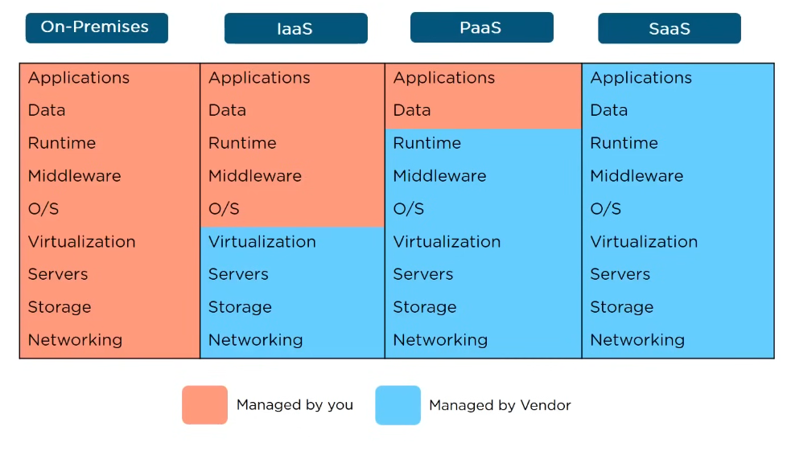

# Cloud Computing Basics

_Cloud computing basics: definitions, service and deployment models, usage patterns_

## Definition

The on-demand delivery of IT resources via the internet.

Characteristics:
* On-demand service
* Network access
* Shared resources
* Scalability

## Use cases

* Data backup
* Disaster recovery
* Email
* Virtual desktops
* Software development and testing
* Big data analytics
* Customer facing web applications

And many others.

## Deployment Models

* Public - owned by the cloud provider and publicly available to clients over the internet.
* Private - exclusively operated by a single organization. May be on-premise or off-premise too.
* Hybrid - mixing private and public clouds for different purposes (e.g., private for data storage and public for internet facing apps).

## Service Models

* IaaS (Infrastructure as a Service) - complete control over the infrastructure, pay for what you use model. Typical users are IT administrators. Examples: AWS, Azure, GCP.
* PaaS (Platform as a Service) - the provider gives a platform for developing, testing and managing applications. The underlying infrastructure is taken care of by the provider. Typical users are software developers. Examples: Heroku, AWS Elastic Beanstalk, Google App Engine.
* SaaS (Software as a Service) - everything is managed by the vendor. Pay-as-you-go payment model. Typical users are end-users. Examples: Google Drive, Google Docs, Microsoft 365.

## Usage Patterns

### Constant usage over time

Common for internal applications where there’s little variation in usage or load.

### Cyclic internal load

Characteristic for batch or data processing applications that run on a predictable cycle, such as close of business; the load, both in time and expected resource consumption, is highly predictable.

### Cyclic external load

Often applies to websites that serve a particular market demand; sites related to entertainment and sporting events often fit this pattern.

### Spiked internal load

Typical in environments where researchers or analysts can submit large-scale, one-time jobs for processing; the demand is usually unpredictable.

### Spiked external load

Seen on the Web when an unknown site suddenly becomes popular, often for a very short time.

### Steady growth over time

Usually for a mature application or website; as additional users are added, growth and resources track accordingly.

