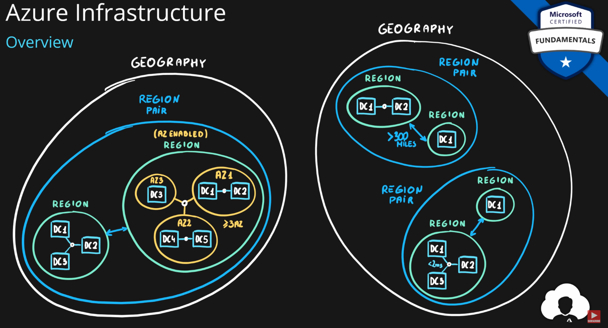

# PaaS Solutions

## Locations

A data center is a physical facility that hosts a group of servers. Multiple data centers connected through high-throughput cables are called a region. Global services are available in every region, while some services are only available in certain regions.

Availability zones are a regional feature where each data center or physically grouped data centers are assigned a unique code. Zonal services make use of the availability zones, to guarantee high availability and fault tolerance. Zone-redundant services automatically replicate data among availability zones (e.g. databases). Most but not all regions support availability zones.

Each region also has a region pair for fault tolerance. Some services provide multi-region replication. Regions are grouped into geographies.

## Databases

### Azure Cosmos DB

Cosmos DB is a NOSQL database that allows the storage of semi-structured collections. It can replicate data among Azure regions and read/write data globally in the closest data center to the user.

It is a schemaless database, with multiple APIs (including SQL) best suited for highly responsive and multi-regional applications.

## Azure SQL

Azure SQL offers many types of databases:

* Azure SQL Database
* Managed Instance
* Azure Synapse Analytics
* SQL VM
* MySQL
* Postgres

## Azure SQL Database

A relational database offerred by Azure, sometimes called as Database as a Service (DBaaS). It offers native SQL support and structured data storage. 

### Configuration

Some of the important configuration options:

* Server name
* Username and password
* Region
* Performance
* Storage size

## DTU and eDTU

DTU (Database Transaction Unit) is a blended measurement that combines CPU, memory and data IO. It is used for configuring databases in Azure, which will determine the performance and the cost of the database.

eDTU is used for in elastic pools where resources are shared across multiple databases. Elastic pools can be cost effective by minimizing underutilization.

Another alternative of DTU is vCore (virtual cores) which provides more granular control (separate CPU and memory setup) and flexbility. It also provides an option to choose between provisioned (pre-allocated) and serverless (auto-scaled) infrastructure.