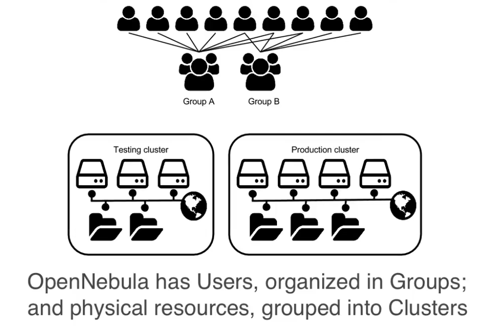
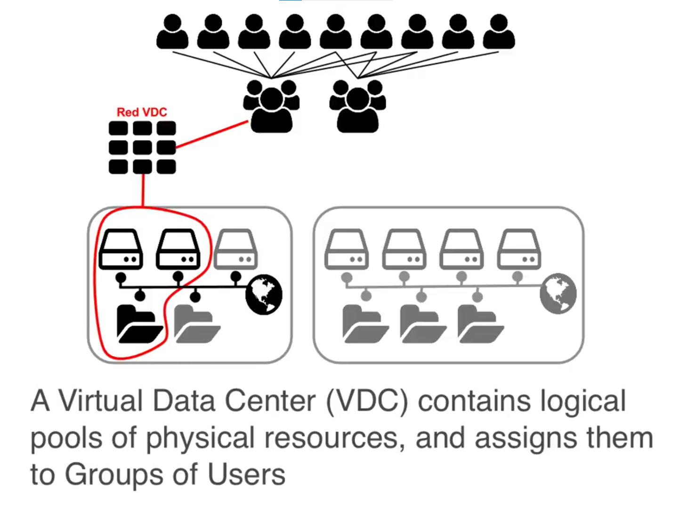
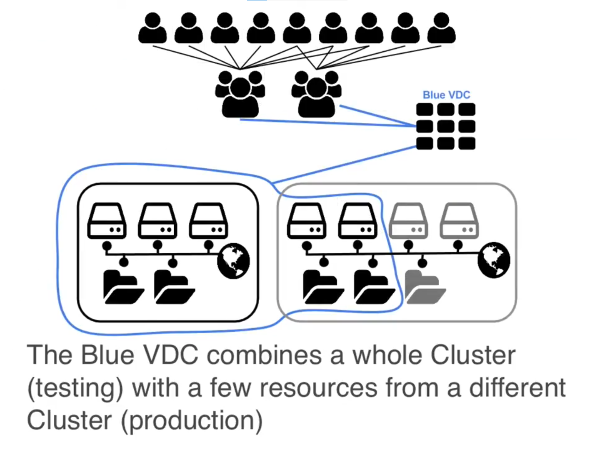
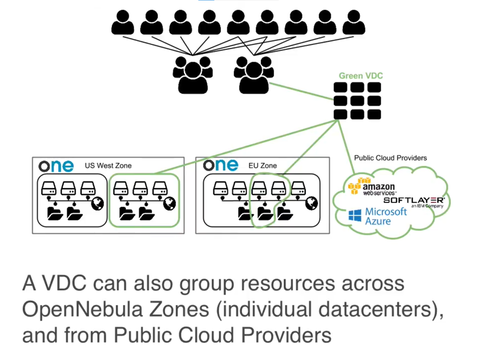

# OpenNebula

_OpenNebula: basic concepts, open cloud reference architecture, virtual data centre approach_

OpenNebula is an open-source infrastructure as a service platform for building private clouds. It support building private and hybrid clouds. Thanks to its extensible nature, OpenNebula provides a way to avoid vendor lock-in.

## Virtual Data Centers

