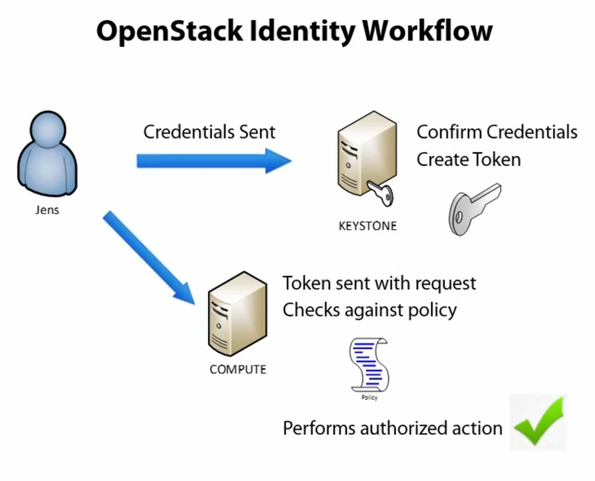

# OpenStack Cloud and Keystone

OpenStack is a collection of modules and projects that work together to create and manage cloud infrastructure (IaaS). Companies can utilize it to orchestrate the virtualization of their servers.

Benefits:
* Affordability (free and open-source)
* Reliability (well-established)
* Vendor neutrality

Downsides:
* Complexity - requires IT expertise
* Support - no central support, clients can only rely on the community
* Consistency - components are constantly added and removed

## Keystone

OpenStack's identity service.

It provides:
* Authentication - identifying the user
* Authorization - granting the user permissions

Entities include:
* Users
* Services
* Endpoints

Tokens are used for authentication and session management.

Tenants are logically separate containers within OpenStack. Multi-tenancy allows multiple tenants on the same hardware while keeping them securely isolated. Tenants have access to global and shared objects.