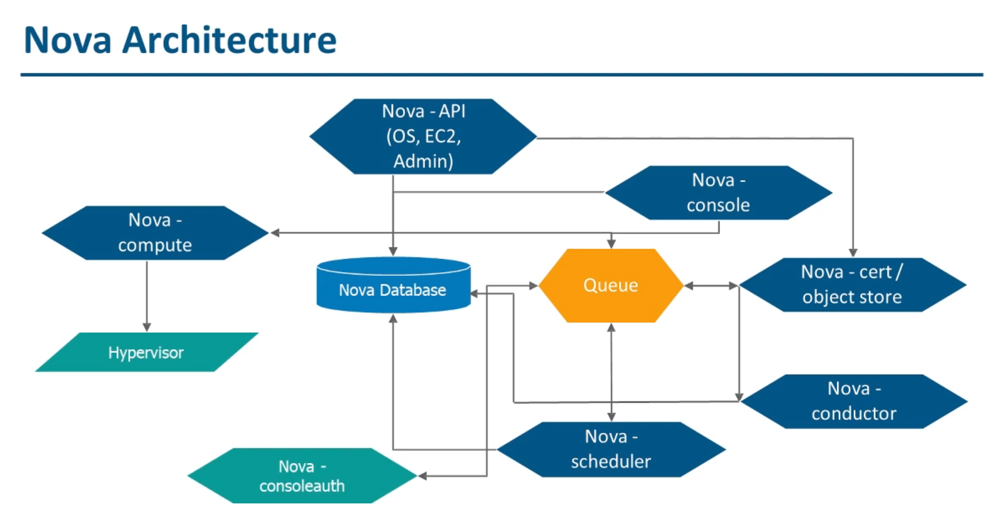
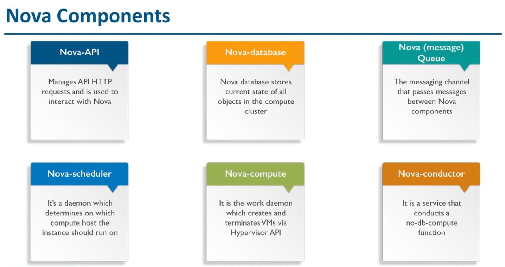
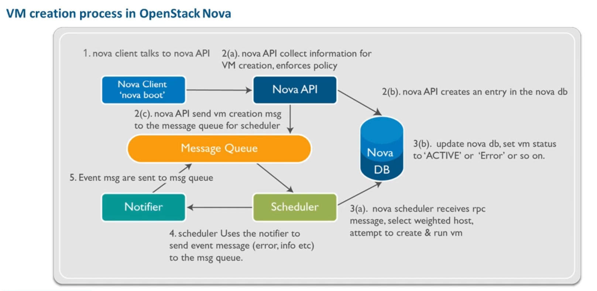
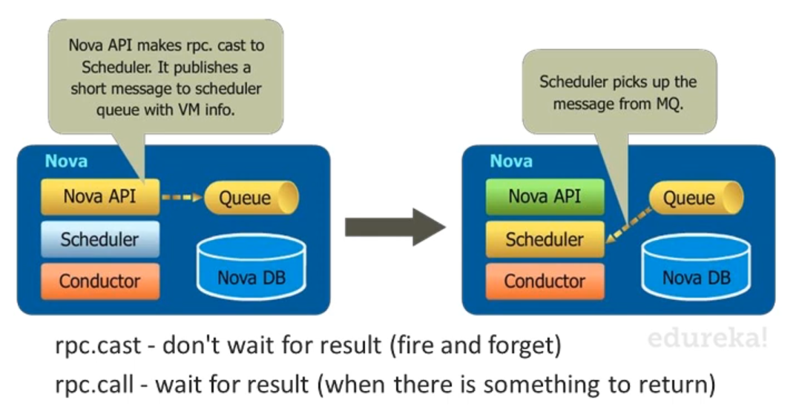
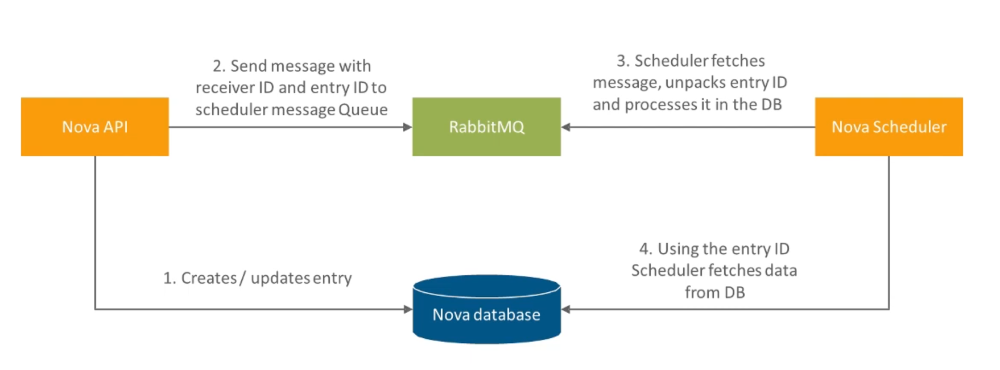
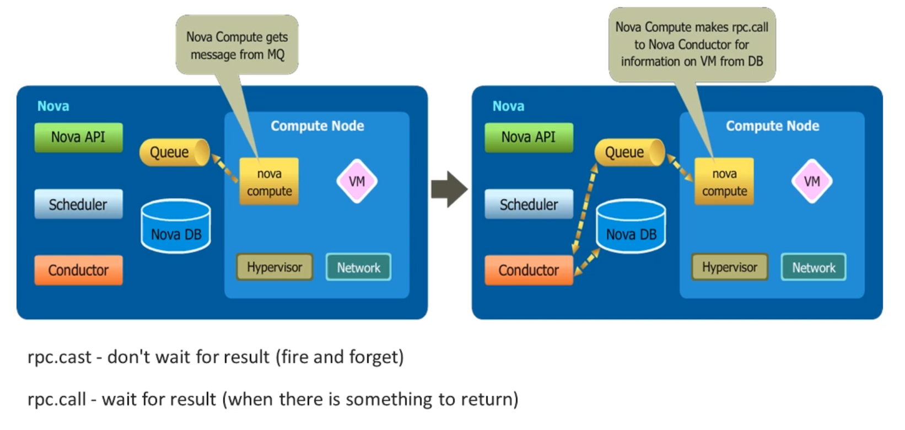

# OpenStack Nova and Neutron

## Hypervisor

A hypervisor, also called a virtual machine manager (VMM), is a program that allows multiple operating systems to share a single hardware host.

Types:
* Type 1 (bare metal) - run on the host's hardware to control it and manage the VMs on it. Examples: Hyper-V, VMware EXS/ESXi, KVM, XenServer, etc. OpenStack makes use of this type.
* Type 2 (hosted hypervisor) - runs on top of the host's operating system. Examples: Oracle VirtualBox, VMware Workstation, etc.

## Nova

OpenStack's compute service. Nova manages the full lifecycle of the virtual machines it creates. It communicates with different modules through a messaging architecture called RabbitMQ.

Supported types of hypervisors include: KVM, LXC, QEMU, UML, Xen, etc.

### Nova API

It works with RPCs (Remote Procedure Calls). Its purpose is to accept and respond to the user's compute calls.

### Nova Message Queue

It uses multiple queues within a single RabbitMQ instance.

Example workflow:

### Nova Scheduler

It is a daemon that determines which compute host the request needs to run on. It is responsible for selecting the host where the instance will be created. There are different filtering (CPU cores, memory, disk space, etc.) and weighting options to decide where the new instance should be created (e.g. it could group the hosts based on the operating system).

### Nova Compute

It creates and terminates VMs using the hypervisor.

### Nova Conductor

It is responsible for communicating with the database and caching the most common responses.

## Neutron

It is responsible for setting up the virtual network infrastructure.

Network segmentation techniques include:
* VLANS
* VXLAN
* GRE
* Network Namespaces
* OpenFlow Rules

### Configuration

Network → Subnets

Separate networks can be connected with virtual routers. Routers can also connect the networks to the internet.

Subnets - CIDR,  IP version and gateway IP, DHCP (created by default)

Source net enables outgoing traffic to the internet, however it does not enable ingress traffic. Floating IPs enable ingress traffic to the instances (they can be likened to elastic IPs in AWS).

### Security Groups

Ingress and egreess rules can be set using security groups. Rules can specify port and CIDR.