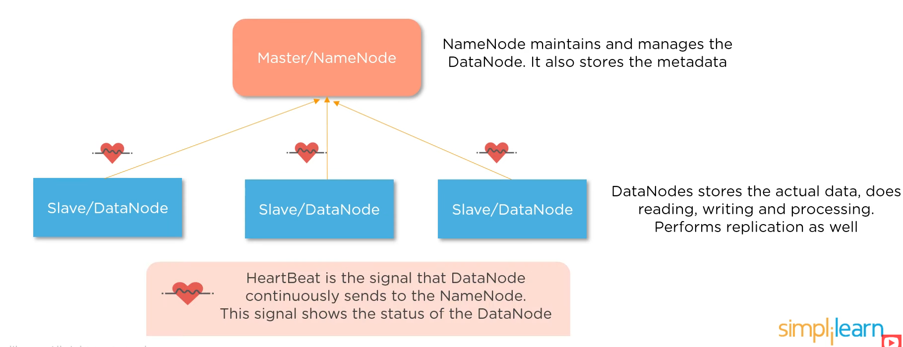
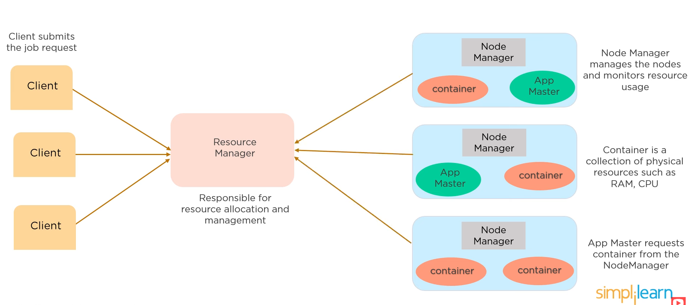
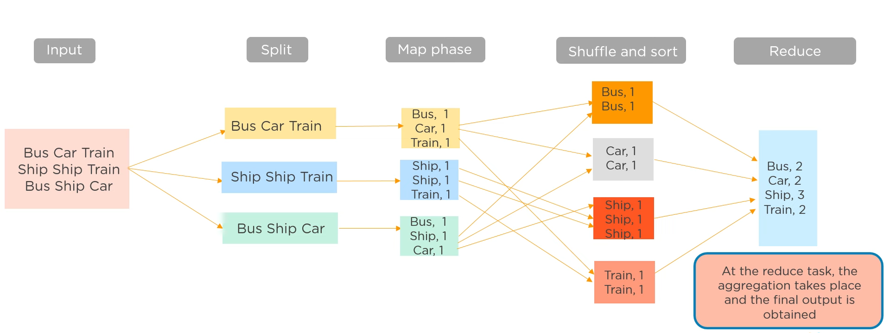

# Big Data Basics

With the advent of smartphones a tremendous amount of data has been generated on the internet, we refer to this as big data. Big data is really valuable for analysis, to infer correlations.

## Classification

Classification happens through (the 5 V's of big data):

* Volume - the amount of data.
* Velocity - the speed of data generation.
* Variety - the different types of data (structured such as a CSV file, semi-structured such as a log file and unstructured such as an image).
* Veracity - the accuracy and reliability of the data.
* Value - the potential value the data brings.

## Hadoop

Apache Hadoop is a collection of open-source software utilities for reliable, scalable, distributed computing.

### HDFS

Hadoop uses a distributed file system called HDFS (Hadoop Distributed File System). The stored data is broken down to chunks (128 MB by default) which are stored redundantly for fault tolerance. The data is then processed in parallel.

It consists of one NameNode (master) and multiple DataNodes (slaves). The NameNode maintains and manages the datanodes and stores metadata about them.

The NameNode is responsible for distributing the input data among the DataNodes.

### YARN

YARN (Yet Another Resource Negotiator) is the resource manager of Hadoop.

## Map Reduce

Map reduce is a programming model that allows computation to be distributed to several machines.

It consists of three stages (with the typical example of word count):
* Map - the chunks are distributed evenly among the computers. Each computer processes its chunks and count the frequency of the words.
* Shuffle - this stage sorts the keys (in this case words) to form groups.
* Reduce - combines the result (adds together the occurences of the same words calculated by different machines).

The final result is sent to the master node.

