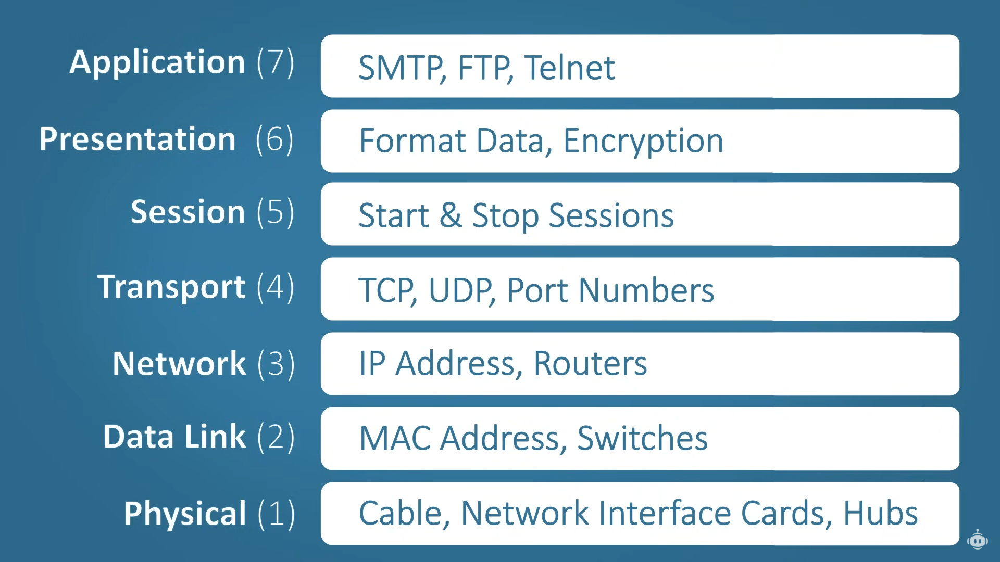
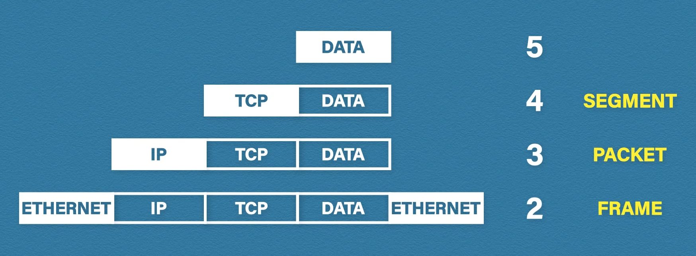

# Layered Architecture Models

# OSI

The OSI (Open Systems Interconnection) is a reference model that divides network commmunication functions into seven layers:

| Layers       |
|--------------|
| Application  |
| Presentation |
| Session      |
| Transport    |
| Network      |
| Data Link    |
| Physical     |

Model was introduced to standardize networks to allow multi-vendor systems. It is not used in practice, just for reference.

### Application Layer

Used by network applications such as web broswers.

Protocols: HTTP, HTTPS, FTP (file transfer), SMTP (emails), Telnet (virtual terminals).

### Presentation layer

It receives data from the application layer. It converts data to machine understandable binary format (e.g. ASCII → EBCDIC). It is also responsible for data compression (either lossy or lossless). Encryption is also handled at this layer.

Protocols: SSL, TLS.

### Session Layer

It is responsible for session management. Authentication and authorization happens at this layer.

### Transport Layer

It controls the reliability of the communication.

* **Segmentation** - data is divided to smaller units called segments. The segments consist of a sequence number, a source and destination port and the data itself and a checksum for error checking. The port number is used for directing the segments to the appropriate applications. The sequence numbers helps with reassembling the data in the correct order.
* **Flow control** - handling the amount of data transmitted at a time. Transmission speed can be increased or decreased depending on the minimum throughput of either of the devices.
* **Error control** - Automatic repeat request is used to retransmit the lost or corrupted data.

Protocols: TCP, UDP.

#### TCP vs UDP

| TCP                                                   | UDP                                        |
|-------------------------------------------------------|--------------------------------------------|
| Connection-oriented                                   | Connectionless                             |
| Slower                                                | Faster                                     |
| Lost data can be retransmitted                        | Best effort                                |
| More overhead                                         | Less overhead                              |
| Ideal for less time-sensitive situations where reliability is needed | Ideal for time-sensitive data transmission |

### Network Layer

Connects networks together. Routers work at this layer. The protocol data unit at this layer is called a packet.

Functions of the network layer:
* Logical addressing - IPs (IPv4/IPv6) are added to the segments to form a packet.
* Routing - moving the packet from the source to the destination address.
* Path determination - finding the optimal path from source to destination.

### Data Link Layer

It allows upper layers to access local media (e.g. cables, air) and controls how data is sent/received from/to the media (this is known as media access control).

It receives data packets from the network layer. While logical addressing (IP) is done at the network layer, physical addressing (MAC - Media Access Control) is done at the data link layer. A frame is formed from the packet by adding the source and destination MAC address and a tail (for error checking) to the packet. Each network interface card (NIC) has a unique MAC address. The data is carried through a local medium. It uses CSMA (carrier-sense multiple access) to avoid collision on shared transmission medium.

### Physical Layer

Physical layer converts binary sequences into signals, and vice-versa, to transmit it via local media (e.g. cable, air).

## TCP/IP

A practical model to standardize computer networking.

Original:

| Layers       |
|--------------|
| Application  |
| Transport    |
| Internet     |
| Link         |

Updated:

| Layers       |
|--------------|
| Application  |
| Transport    |
| Internet     |
| Data Link    |
| Physical     |

 ## Encapsulation

 As we progress down the layers, each layer adds its own bit of information. This process is called encapsulation. As we progress up the layers, each layer removes the layer-relevant information. This process is called decapsulation.

 

## Addressing

Addressing in the transport layer is done through ports, in the network layer it is done through IP addresses and in the data-link layer through MAC addresses.