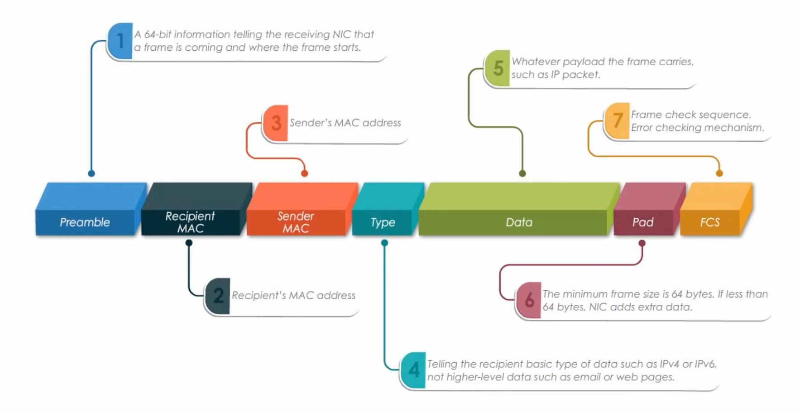
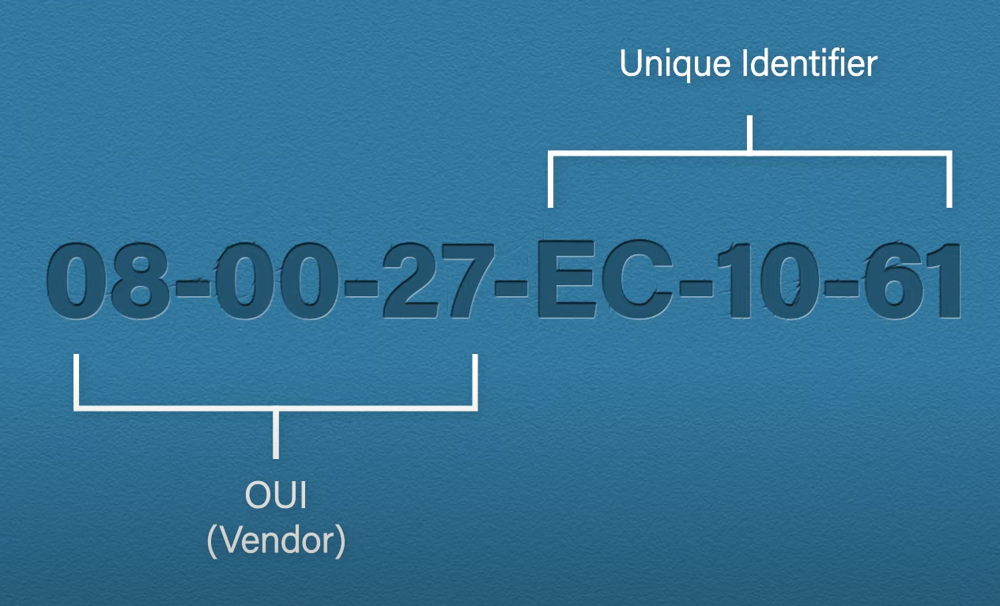
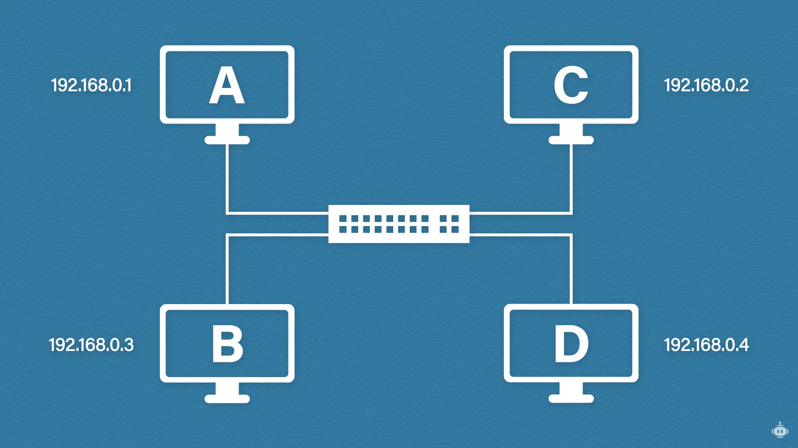

# Data Link Layer

It allows upper layers to access local media (e.g. cables, air) and controls how data is sent/received from/to the media (this is known as media access control).

It receives data packets from the network layer. While logical addressing (IP) is done at the network layer, physical addressing (MAC - Media Access Control) is done at the data link layer. A frame is formed from the packet by adding the source and destination MAC address and a tail (for error checking) to the packet. The data is carried through a local medium.

It uses CSMA/CD (carrier-sense multiple access with collision detection) to avoid collision on shared transmission medium. The algorith keeps checking the medium whether it is free then sends the data. In case of a collision, it waits for a bit and tries again.

## Parts

* Logical Link Control (LLC) - implemented in software, it manages communication between devices over the network, handling error checking and flow control.
* Media Access Control (MAC) - abstraction to hardware, it uses MACs to identify source and destination devices.

## Structure of an Ethernet Frame

## MAC Addresses

MAC (Media Access Control) is a unique identifier of a network interface card (NIC). These are physical addresses (burnt into the chips) although they can be spoofed. The first three bytes are called OUI (Organizationally unique identifier) while the other 3 bytes are the unique identifier.

### Types:

* Unicast - a unique MAC address
* Multicast - a MAC address for an application or protocol
* Broadcast - sent to all devices (`FF-FF-FF-FF-FF`)

## ARP

Address Resolution Protocol is used for resolving IPs to MAC addresses.

Example:

If in the above setup A wants to communicate with B but does not know its MAC address, it will send an ARP request which will be broadcast to every host except for A. All the other computers will discard the message except for B, which will respond with its MAC address.

Each host has its own ARP cache where IP-MAC mappings are stored. It works as a lookup table to find MAC addresses based on IP addresses.

## Ethernet

Ethernet is a communication standard for local area networks (LANs). IEEE 802.3 (released in 1983) defines the specification of Ethernet. It is a wired system that supports coaxial, twisted pair copper and fiber optic cables.

Twisted pair cables have different categories that provide different level of shielding and throughput. It uses RJ45 connectors and can receive data in half (only one direction at a time) or full-duplex mode (both directions at the same time).

Fiber-optic cable makes use of light to transit data. It uses several different types of connectors (e.g. SFP or SC). It requires an Ethernet to fiber converter to convert the signals to digital.

### Devices

* Hosts with a NIC (PC, printers, etc.)
* Switches and routers
* Gateways and bridges (routers and switches that connect networks or network segments)