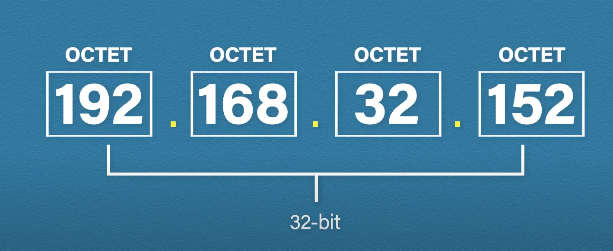
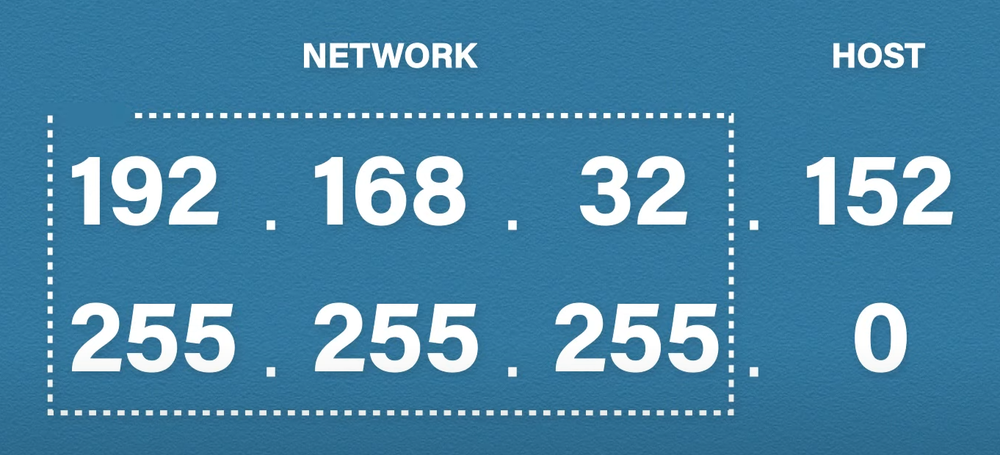
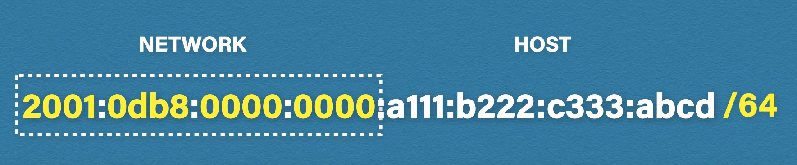
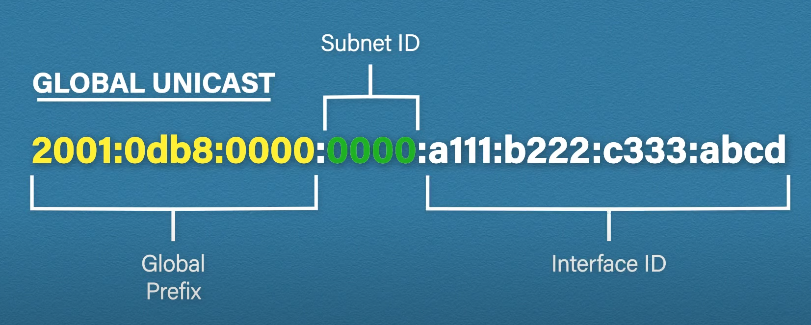

# Network Layer Services And Tasks

Connects networks together. Routers work at this layer. The protocol data unit at this layer is called a packet.

Functions of the network layer:
* Logical addressing - IPs (IPv4/IPv6) are added to the segments to form a packet.
* Routing - moving the packet from the source to the destination address.
* Path determination - finding the optimal path from source to destination.

## IP Addresses

IP is a unique identifier assigned to each device connected to a computer network.

### IPv4

A 32-bit long address containing 4 octets separated by dots. It can take any value between 0 and 255. Subnet masks are paired with IP addresses which help identifying the network and the host parts of the IP address. Translated to binary, the ones in the subnet mask represent the network part and the zeros the host part.

### Classes

Private IP addresses only need to be unique within the network.

| **Class** | **IP Range**                | **Private IP Range**          | **Default Subnet Mask** | **Network Type**             |
|-----------|-----------------------------|-------------------------------|-------------------------|------------------------------|
| A         | 1.0.0.0 – 126.255.255.255   | 10.0.0.0 – 10.255.255.255     | 255.0.0.0               | Large networks (Enterprise)  |
| B         | 128.0.0.0 – 191.255.255.255 | 172.16.0.0 – 172.31.255.255   | 255.255.0.0             | Medium-sized networks        |
| C         | 192.0.0.0 – 223.255.255.255 | 192.168.0.0 – 192.168.255.255 | 255.255.255.0           | Small networks (Home/Office) |

## IPv6

Since there are only a little over 4B IPv4 addresses, a new addressing scheme had to be created. Since IPv6 addresses are 128-bit long, there are 2128 available addresses. IPv6 addresses consist of 8 hextets, separated by colons. Each character is 4 bits long and represented in hexadecimal.

### Making the address shorter

The longest blocks of zeroes can be replaced by double colon. Leading zeros can be dropped (in case of a block only consisting of 0 a single zero must be kept).

### Types

Global unicast address - an address routable over the internet (every device can have its own public IP address thanks to the large pool of addresses).

| Type           | Address   | Description            |
|----------------|-----------|------------------------|
| Global unicast | 2000::/3  | Publicly routable      |
| Unique local   | FC00::/7  | Routable in the LAN    |
| Link local     | FE80::/10 | Not routable           |
| Multicast      | FF00::/8  | Addresses for groups   |
| Anycast        | 2000::/3  | Shared address         |
