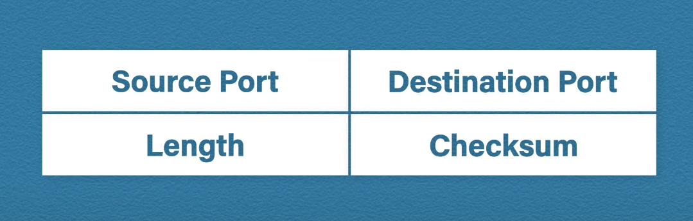

# Transport Layer Services And Tasks

_Transport layer services and tasks, TCP, UDP characteristics and operation_

It controls the reliability of the communication. The protocol data unit at this layer is called a segment.

* **Segmentation** - data is divided to smaller units called segments. The segments consist of a sequence number, a source and destination port and the data itself and a checksum for error checking. The port number is used for directing the segments to the appropriate applications. The sequence numbers helps with reassembling the data in the correct order.
* **Flow control** - handling the amount of data transmitted at a time. Transmission speed can be increased or decreased depending on the minimum throughput of either of the devices.
* **Error control** - Automatic repeat request is used to retransmit the lost or corrupted data.

## TCP

Transmission Control Protocol is a reliable transmission protocol. It is reliable, because it retransmits lost or corrupted segments.

It achieves reliability with the help of:
* Acknowledgment numbers
* Sequence numbers
* Checksums

### TCP Handshake

To establish a connection, TCP does a three-way handshake (SYN, SYN-ACK, ACK).

1. The sender sends a SYN (synchronize) message.
2. The receiver sends and ACK (acknowledgment) and its own SYN.
3. The sender send and ACK to acknowledge the receivers SYN.

Sequence numbers are used for reassembling data.

### TCP Connection Example

The initial sequence number is actually a randomly selected number, in this case for simplicity 0 is selected.

The server and the client do a three-way handshake. The sequence numbers are kept track of separately (one for the server, one for the client). The ACK number shows the next byte it expects.

Different flags can be set during communication such as:

* URG - urgent (rarely used today)
* ACK - acknowledgement number
* PSH - push (immediate delivery, rarely used today)
* RST - reset (terminate connection immediately)
* SYN - synchronize
* FIN - close connection (gracefully)

### TCP Header

## UDP

User Datagram Protocol is an unreliable transmission protocol. It is ideal for real time connections, such as streaming, since it does not retransmit lost or malformed segments. It is connectionless (no handshake required before communication).

### UDP Header

