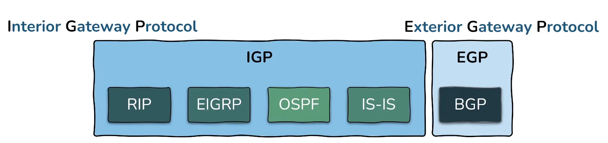
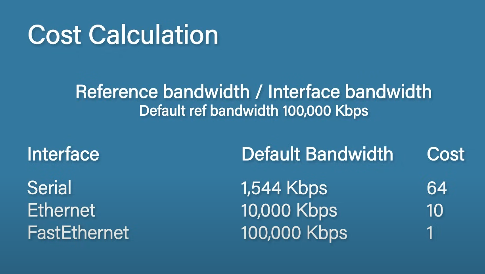

# Routing - Features, Classification And Operation

# Routing

A network is a logical grouping of hosts. Routing is the process of moving data between networks. Routers find path using the network layer but communicate with each other on the link layer, each of them de-encapsulating the frame then re-encapsulating it for the next hop. The difference between routers and host is that routers forward packets that are not destined to themselves.

## Routing Table

Routers maintain a map about all the networks they are connected to which is called the routing table. It maps IPs to physical ports.

Routing tables can be populated three ways:
* Directly connected networks
* Static routes (manually set mappings)
* Dynamic routes (networks learned from other routers)

## Protocols

Autonomous system - any set routers/networks under a single administrative control.

### IGP

Interior Gateway Protocols are for sharing routes within autonomous systems. IGPs are optimized for speed and responsiveness.

#### DVR

Distance Vector Protocols only have knowledge about the next hop. Thanks to this its resource demands are minimal. It converges slower than LSRs, since its only aware of the next hop.

Examples:
* RIP (Routing Information Protocol)
* EIGRP (Enhanced Interior Gateway Routing Protocol, advanced DVR that comes with some LSR features)

#### LSR

Link State Protocols have knowledge about the entire network topology. Due to this, this protocol consumes more CPU power/RAM. They come with the advantage of fast convergence (thanks to knowing the full topology).

Examples:
* OSPF (Open Shortest Path First)
* IS-IS (Intermediate System to Intermediate System)

##### OSPF

In case of Open Shortest Path First (OSPF) the routers send out link state advertisements (LSA) containing information about the subnet, router and additional network information. The received information is stored in a link state database (LSDB). The goal is to have the same data in all routers' LSDB.

Components:
* DR (Designated Router) - DRs and BDRs are elected based on the highest OSPF priority (this can be set on each router). In case of a tie, the router with the highest RID is selected as the DR. The DR acts as a central authority that orchestrates LSDB updates. When a link goes down on a router, the router floods the network to update their LSDB. The routers drop the update, except for the DR which updates its LSDB then floods the network with the update to which the other routers also listen to.
* BDR (Backup Designated Router)

Steps:
1. Form neighbor relationship - two routers connected.
   1. Router ID (RID) is set. It can be set manually or the router chooses the highest used (UP) IP address.
   2. Exchanging "Hello" messages containing the router's ID and its known neighbors. On top of establishing relationship, it also serves as a health check to indicate that the router is still available.
   3. The routers need to check the requirements of the neighbor relationship (e.g. same area ID, subnet, hello and dead interval and unique RID).
   4. If the router complied with all the requirements, it moves to the init state.
   5. The router sends a hello to the original sender which sees itself as a known neighbor now and moves to the 2-way state.
   6. The original sender sends another Hello message and the receiving router moves to the 2-way state.
   7. The neighbor relationship is formed.
2. Exchange database information - routers share their LSDB.
   1. Routers enter the exstart state.
   2. The two routers select a slave and master (based on the RID). (In case of non-point-to-point networks, this is formed between a router and the DR).
   3. The routers send their list of LSAs (DBDs or database descriptions) to each other.
   4. The routers enter the loading state.
   5. The routers check the DBD and request missing information via a Link State Request (LSR).
   6. The other router responds with a Link State Update (LSU).
   7. The original router responds with a Link State Acknowledgment (LSAck).
   8. Once the all the exchanges have completed, the routers enter full neighbor relationship.
3. Choose the best routes - by calculating the SPF value the best route is selected and added to the routing table.
   1. OSPF selects the best route based on cost.

### EGP

Exterior Gateway Protocols are for sharing routes between autonomous systems. They are optimized for stability, security and control (e.g. by limiting where it accepts IP advertisements from). It can influence route selection of ISPs multiple autonomous systems away.

Examples:
* BGP