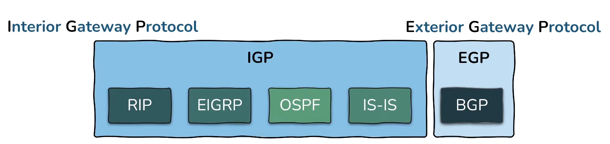

# Routing - Interior Gateway Routing Protocols

# Routing

A network is a logical grouping of hosts. Routing is the process of moving data between networks. Routers find path using the network layer but communicate with each other on the link layer, each of them de-encapsulating the frame then re-encapsulating it for the next hop. The difference between routers and host is that routers forward packets that are not destined to themselves.

## Routing Table

Routers maintain a map about all the networks they are connected to which is called the routing table. It maps IPs to physical ports.

Routing tables can be populated three ways:
* Directly connected networks
* Static routes (manually set mappings)
* Dynamic routes (networks learned from other routers)

## Static Routing

Static routing is manually configuring the routes the packets should take. It is generally used in small networks. It is useful in situations where security is a major concern.

Benefits of static routing:
* Simplicity - easy to configure, in case of small networks it is easy to maintain.
* Security - more control over the path the data takes.
* Predictability - predetermined paths.
* Reliability - more reliable than dynamic routing (does not have the limitation of algorithms).
* Performance - sometimes more efficient than dynamic routing.

## Dynamic Routing

It makes use of algorithms to dynamically populate its routing table.

Benefits:
* Automatically adapts to changes in the network
* More flexible and resilient than static routing
* Often times more complex to set up than static routing
* Fewer benefits (vulnerabilities in the routing protocols)

Autonomous system - any set routers/networks under a single administrative control.

### IGP

Interior Gateway Protocols are for sharing routes within autonomous systems. IGPs are optimized for speed and responsiveness.

#### DVR

Distance Vector Protocols only have knowledge about the next hop. Thanks to this its resource demands are minimal. It converges slower than LSRs, since it is only aware of the next hop.

Examples:
* RIP (Routing Information Protocol)
* IGRP (Interior Gateway Protocol)
* EIGRP (Enhanced Interior Gateway Routing Protocol, advanced DVR that comes with some LSR features, because of this it can be classified as both DVR and LSR)

#### LSR

Link State Protocols have knowledge about the entire network topology. Due to this, these protocols consume more CPU power/RAM. They come with the advantage of fast convergence (thanks to knowing the full topology).

Examples:
* OSPF (Open Shortest Path First)
* IS-IS (Intermediate System to Intermediate System)

### EGP

Exterior Gateway Protocols are for sharing routes between autonomous systems. They are optimized for stability, security and control (e.g. by limiting where it accepts IP advertisements from). It can influence route selection of ISPs multiple autonomous systems away.

Examples:
* BGP (Border Gateway Protocol)

## Routing Metrics

Routing metrics are used by routers for path determination.

These include:
* Hop count - number of routers that the packet passes through until the destination.
* Bandwidth/cost - higher bandwidth = lower cost.
* Traffic - current amount of traffic on a link.
* Delay/latency - the amount of time for the packet to reach the destination.
* MTU - maximum transmission unit on a given path.
* Reliability - the likelihood of the given link failing or experiencing errors.
