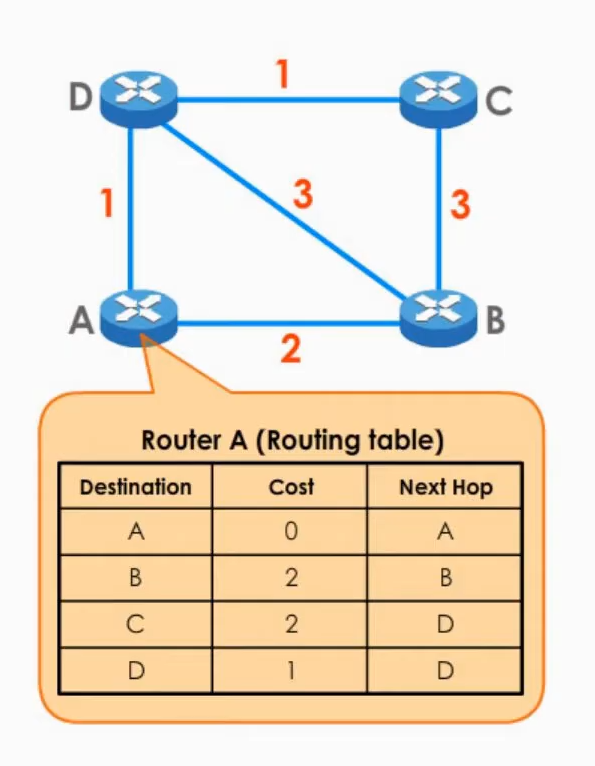

# Routing - Distance Vector Routing Protocols

Distance vector routing protocols include:
* RIP (v1 and v2)
* IGRP (Interior Gateway Routing Protocol)
* EIGRP (Enhanced Interior Gateway Routing Protocol)

Each hop has a cost (measured by latency and other network conditions). The routing table has a list of every other router in the network and the next hop to take to reach the specific router. A router can only see its direct neighbors which they exchange information with, this is referred to as routing by rumor.

## RIP

Routing information protocol is an old distance vector routing protocol that has two versions.

### RIPv1

* Maximum 15 hops
* Slow convergence
* Easy to implement
* Suitable for small networks

### RIPv2

* Supports VLSM (variable length subnet mask)
* Less broadcast traffic
* More secure

## IGRP

Interior gateway routing protocol was designed to address some of the limitations of RIP such as slow convergence and hop limit. Its successor is EIGRP (Enhanced IGRP).

## EIGRP

A hybrid Cisco proprietary distance vector/link state protocol. It is considered a distance vector routing protocol as it builds on the principles of IGRP, however it is also considered link state since all routers have the full topology. It uses incremental updates (only send the changes) and uses numerous metrics to determine the best path.

It has fast convergence, uses low bandwidth, and it is mainly used by enterprise networks.

## Comparison of Distance Vector And Link State Routing

| Distance Vector Routing Protocol                                                       | Link State Routing Protocol                                                               |
|----------------------------------------------------------------------------------------|-------------------------------------------------------------------------------------------|
| Each router only shares its routing table with its neighbors                           | Each router shares its complete map of the network with all other routers                 |
| Making routing decisions based on limited information                                  | With a complete view of the network, routing decisions are more accurate and reliable     |
| Easy to set up and configure                                                           | Difficult to set up and configure                                                         |
| Slow convergence                                                                       | Fast convergence                                                                          |
| The metric is typically based on the number of hops between the source and destination | The metric can be based on a variety of factors, such as the bandwidth or delay of a link |
| Suited for smaller networks                                                            | Suited for larger networks                                                                |
