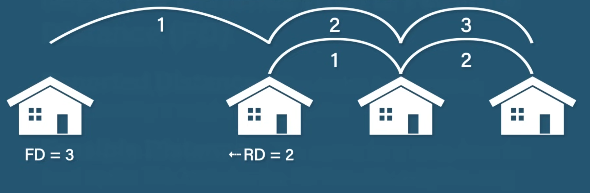
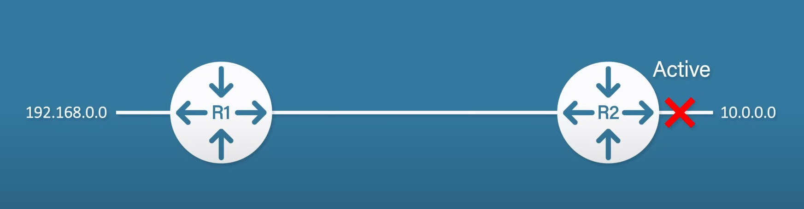

# Routing - Distance Vector Routing Protocols

Distance vector routing protocols include:
* RIP (v1 and v2)
* IGRP (Interior Gateway Routing Protocol)
* EIGRP (Enhanced Interior Gateway Routing Protocol)

Each hop has a cost (measured by latency and other network conditions). The routing table has a list of every other router in the network and the next hop to take to reach the specific router. A router can only see its direct neighbors which they exchange information with, this is referred to as routing by rumor.

## RIP

Routing information protocol is an old distance vector routing protocol that has two versions.

### RIPv1

* Maximum 15 hops
* Slow convergence
* Easy to implement
* Suitable for small networks

### RIPv2

* Supports VLSM (variable length subnet mask)
* Less broadcast traffic
* More secure

## IGRP

Interior gateway routing protocol was designed to address some of the limitations of RIP such as slow convergence and hop limit. Its successor is EIGRP (Enhanced IGRP).

## EIGRP

A hybrid (previously Cisco proprietary, now an open standard) distance vector/link state protocol. It is considered a distance vector routing protocol as it builds on the principles of IGRP, however it is also considered link state since all routers have the full topology. It uses incremental updates (only send the changes) and uses numerous metrics to determine the best path.

It has fast convergence, uses low bandwidth, and it is mainly used by enterprise networks.

### Operation

EIGRP has a 3-step process:
1. Form neighbor relationship (for example between R1 and R2).
   1. A HELLO message is sent. These messages are also used to maintain neighbor relationships. These messages are sent every 5 seconds by default on high bandwidth links, with a hold timer of 15 seconds (3×HELLO interval) which is the maximum amount of time the router will wait before marking the link dead.
   2. R2 checks the neighbor requirements (e.g. same autonomous system number, subnet, k-values [different metrics, by default only bandwidth and delay] and authentication).
   3. If the requirements were fulfilled, the neighbor relationship is formed.
2. Exchange routing information - neighbors exchange routing information.
   1. EIGRP uses RTP (Reliable Transport Protocol) to exchange data between routers. It uses the diffusing update algorithm (DUAL) for pathfinding.
   2. The routers exchange full update messages that include all routing information known by the router. An ACK message is used to acknowledge that the information was received.
   3. Once routing information has been exchanged only partial updates will be sent from then on.
3. Choose the best routes - each router chooses the best route and adds it to its routing table.
   1. A formula is used to calculate the metric based on the k-values.
   2. There are two types of distances:
      * Reported Distance (RD) - distance of the target from a specific router (relative distance).
      * Feasible Distance (FD) - the absolute distance between you and the target. It can be calculated from the RD by adding the distance between you and the router that reported the RD + the value of the RD.
   3. There are two types of routes:
      * Successor - the router with the best metric to the destination. In case of multiple successor routes, EIGRP load balances between them.
      * Feasible successor - a backup route in case the successor fails. This facilitates very quick convergence.

#### Link Failure

Links are in a passive state while operating and active while they are down.

In the above example, R2 would send a message to R1 to request a new route to `10.0.0.0`. R1 would either send a new route if it has access to `10.0.0.0` or respond saying that it does not have access to that network. In the latter case, the network needs to be removed from the routing table.

## Comparison of Distance Vector And Link State Routing

| Distance Vector Routing Protocol                                                       | Link State Routing Protocol                                                               |
|----------------------------------------------------------------------------------------|-------------------------------------------------------------------------------------------|
| Each router only shares its routing table with its neighbors                           | Each router shares its complete map of the network with all other routers                 |
| Making routing decisions based on limited information                                  | With a complete view of the network, routing decisions are more accurate and reliable     |
| Easy to set up and configure                                                           | Difficult to set up and configure                                                         |
| Slow convergence                                                                       | Fast convergence                                                                          |
| The metric is typically based on the number of hops between the source and destination | The metric can be based on a variety of factors, such as the bandwidth or delay of a link |
| Suited for smaller networks                                                            | Suited for larger networks                                                                |
