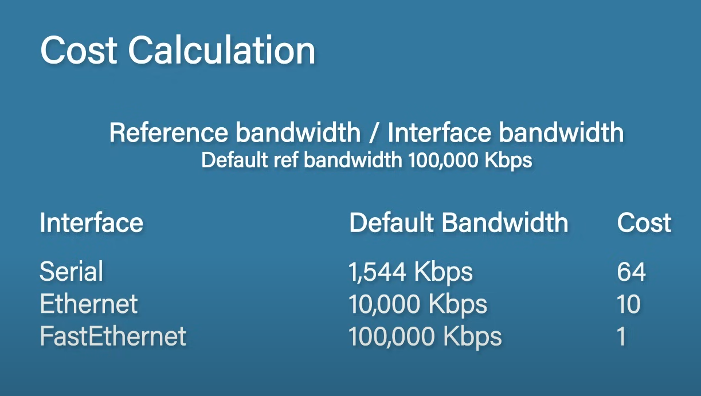
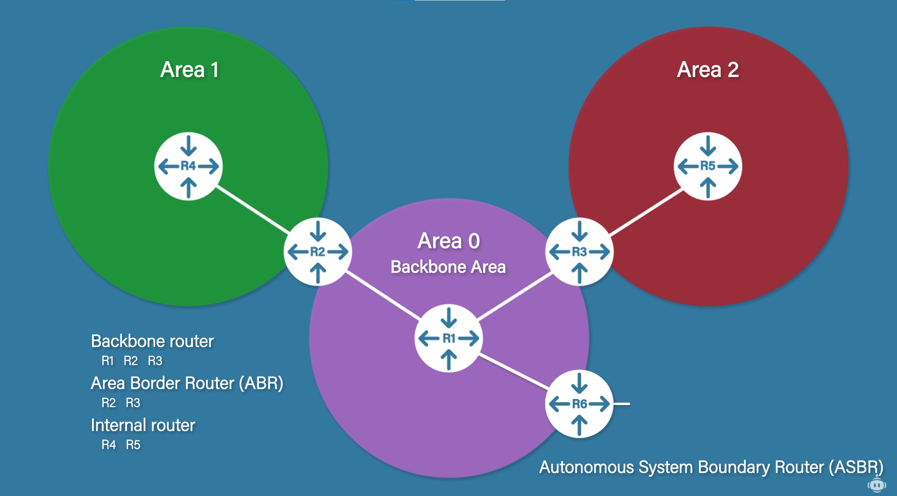

# Routing - Link State Routing Protocols

Link State Protocols have knowledge about the entire network topology. Due to this, these protocols consume more CPU power/RAM. They come with the advantage of fast convergence (thanks to knowing the full topology).

Examples:
* OSPF (Open Shortest Path First)
* IS-IS (Intermediate System to Intermediate System)

## OSPF

In case of Open Shortest Path First (OSPF) the routers send out link state advertisements (LSA) containing information about the subnet, router and additional network information. The received information is stored in a link state database (LSDB). The goal is to have the same data in all routers' LSDB.

Components:
* DR (Designated Router) - DRs and BDRs are elected based on the highest OSPF priority (this can be set on each router). In case of a tie, the router with the highest RID is selected as the DR. The DR acts as a central authority that orchestrates LSDB updates. When a link goes down on a router, the router floods the network to update their LSDB. The routers drop the update, except for the DR which updates its LSDB then floods the network with the update to which the other routers also listen to.
* BDR (Backup Designated Router)

Steps:
1. Form neighbor relationship - two routers connected.
   1. Router ID (RID) is set. It can be set manually or the router chooses the highest used (UP) IP address.
   2. Exchanging "Hello" messages containing the router's ID and its known neighbors. On top of establishing relationship, it also serves as a health check to indicate that the router is still available.
   3. The routers need to check the requirements of the neighbor relationship (e.g. same area ID, subnet, hello and dead interval and unique RID).
   4. If the router complied with all the requirements, it moves to the init state.
   5. The router sends a hello to the original sender which sees itself as a known neighbor now and moves to the 2-way state.
   6. The original sender sends another Hello message and the receiving router moves to the 2-way state.
   7. The neighbor relationship is formed.
2. Exchange database information - routers share their LSDB.
   1. Routers enter the exstart state.
   2. The two routers select a slave and master (based on the RID). (In case of non-point-to-point networks, this is formed between a router and the DR).
   3. The routers send their list of LSAs (DBDs or database descriptions) to each other.
   4. The routers enter the loading state.
   5. The routers check the DBD and request missing information via a Link State Request (LSR).
   6. The other router responds with a Link State Update (LSU).
   7. The original router responds with a Link State Acknowledgment (LSAck).
   8. Once the all the exchanges have completed, the routers enter full neighbor relationship.
3. Choose the best routes - by calculating the SPF value the best route is selected and added to the routing table.
   1. OSPF selects the best route based on cost.

### Multi-Area OSPF

Issues arise with large networks, with the LSDB getting too large and routing slowing down due to the size of the routing table. To address this, multi-area OSPF can be configured. In this case, each router is only responsible for managing its own area and lets the backbone network deal with external networks.

* Backbone router - any router in or partially in the backbone area.
* Area Border Router (ABR) - a router connecting more than one area.
* Internal router - routers contained within a single area that is not the backbone area.
* Autonomous System Boundary Router (ASBR) - routers connecting to other non-OSPF protocols (e.g. public internet router).

## IS-IS

Typically used in larger enterprise networks, it is highly scalable and flexible and supports IPv4 and IPv6. It is less common than OSPF. In principle, it works very similarly to multi-area OSPF however it is not as IP centric as OSPF while IS-IS works mostly at layer 2.

In IS-IS routers are assigned different levels:
* Level 1 - only talks to level 1 routers in its area.
* Level 2 - backbone routers.
* Level 1/2 - it has information about their area and the backbone and can talk to both level 1 and level 2 routers.