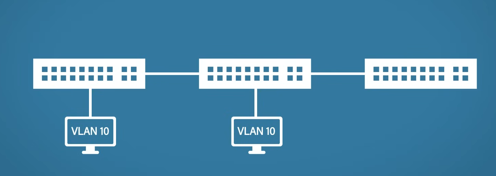

# Switching

Switching is the process of moving data within the network. Switches are devices whose primary purpose is switching. The connected devices must belong to the same IP network. By default, switches are layer 2 devices although layer 3 switches also exist.

The predecessor of switches is hubs, which flood the traffic to all the ports of the hub. This made hubs inefficient and insecure. Switches on the other hand map physical ports to connected devices and only forward traffic to the appropriate devices based on the device's MAC address.

## Operation

### Sending Data

Suppose that host A wants to communicate with host D.

The following steps would be taken:
* Host A adds a layer 3 header to the data with the source and destination IP addresses
* Host A checks the ARP cache and if it cannot find host D's IP in the table, then it performs an ARP request to get host D's MAC
* Then it adds a layer 2 header which includes the source and destination MAC addresses
* It forwards the frame to the switch which forwards the frame to host D

### MAC Address Table

This is where the switch ports are mapped to MAC addresses.

### Actions

A switch can perform the following actions:
* Learn - it updates the MAC address table whenever there is incoming traffic from a device.
* Flood - when the switch cannot find the destination MAC address in its MAC address table, it floods the frame to all ports (except for the receiving port). All devices will drop the frame, except for the target device, which will respond and the switch can once again perform the learning action, to associate the target device's MAC address with the appropriate port.
* Forward - if the target device's MAC address can be found in the MAC address table, the switch simply forwards the traffic to the appropriate port based on that.

### Types of Frames

* Unicast - destination MAC address is another host.
* Broadcast - these frames are flooded on the network (MAC address for broadcast: `FF-FF-FF-FF-FF-FF`).
* Multicast - addressed to a specific group of devices (they are flooded by default, unless IGMP snooping is enabled, in which case only the relevant devices receive the frame).

## VLANs

A virtual local area networks allow the isolation of switch ports into independent groups. This logical grouping essentially creates separately switched networks. Each VLAN will do the learning, flooding and forwarding processes independently and have their own MAC address table.

One of the main reasons to use VLAN is to reduce broadcast traffic. A big benefit of VLANs is that they do not require an extra piece of hardware (unlike adding more switches or routers to the network).

### Tagging

Most switches have a default VLAN called VLAN 1. By default, every interface is assigned to the default VLAN. A total of 4096 VLANs can be created on one switch.

The same VLANs can be implemented on multiple switches.

There are two types of ports on switches:
* Access ports - when a port is assigned to a VLAN.
* Trunk ports - a port that can forward traffic from different VLANs.

The switch tags the frame with the appropriate VLAN ID so that the traffic will be forwarded to the appropriate VLAN. This is called 802.1Q tag.

The 802.1Q includes:
* TPID - tag protocol identifier, it identifies the frame as 802.1Q tagged frame.
* TCI - tag control information, it contains the priority code point (PCP), DEI (drop eligible indicator) and the VLAN ID.

#### Native VLAN

The default native VLAN is VLAN 1. When native VLAN is forwarded between switches, it remains untagged. It is mainly useful for compatibility with other devices that do not support VLAN tags (e.g. hubs).

## Protocols

### VTP

By default, VLANs would have to be configured on each individual switch. VLAN trunking protocol was created to solve this problem. It allows you to configure the VLAN on just one switch and replicate it to others.

Each switch has its own VLAN database and revision number. Each time the database changes, the revision number will increase by one. The goal is to have every switch the same database and revision number.

Summary advertisements are sent out (every 5 minutes by default) which contains:
* VTP domain name
* VTP password
* Revision number
* Followers (whether another message will follow)

In case a switch receives a summary advertisement with a revision number smaller than or equal to its own, it will ignore it. Otherwise it responds with an advertisement request to retrieve information about what changed.

Subset advertisements are sent whenever a VLAN is added or removed. These include:
* Domain name
* VLAN information

#### Requirements

* Links must be trunks
* Same VTP domain name
* Same password (if set)

#### VTP Modes

* Server - it can create VLANs and create/send updates about VTP databases.
* Client - cannot create VLANs but can also create/send updates about the VTP database.
* Transparent - it can create local VLANs and forward advertisements but cannot create/update the database. Essentially out of the VTP network.

#### Issues

It is very easy to accidentally delete the VLANs on all the switches, thanks to the fact that it only needs to be changed on a single switch (e.g. the user unplugs the switch, makes some changes and plugs it back again).

#### VTP Pruning

VTP pruning allows switches to tell each others which VLANs they have ports for.

In the above configuration if the first switch sends VLAN 10 broadcast message on its link, the second switch would also forward that to the third switch. This network overhead can be eliminated by proper VTP pruning setup.

### DTP

Dynamic trunking protocol is Cisco proprietary protocol. It helps with automatically selecting the appropriate mode for the port based on the connected device.

The switch sends DTP queries regularly over the network.

There are four different modes the ports can assume:
* Dynamic auto - passive mode, it waits for the opposite switch to receive messages from. The port becomes trunk if the opposite is trunk or desirable. Otherwise, it turns into access mode while still propagating DTP requests.
* Dynamic desirable - active mode, sends DTP queries to the opposite switch to make trunk proposal
* Trunk - sends DTP queries to the other switch.
* Access - disables DTP queries.
