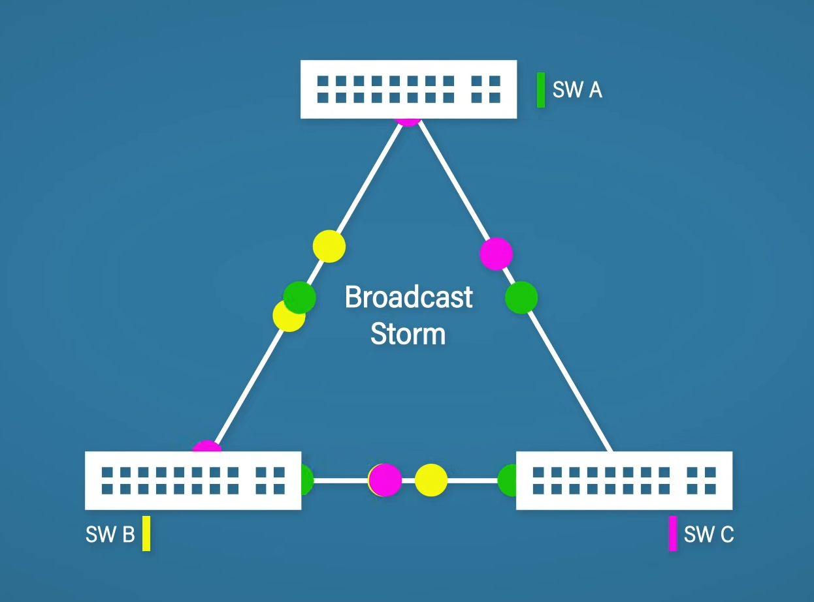
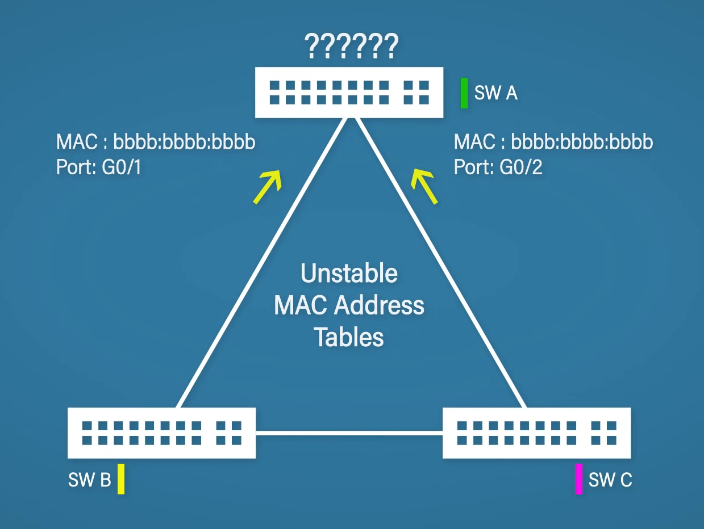
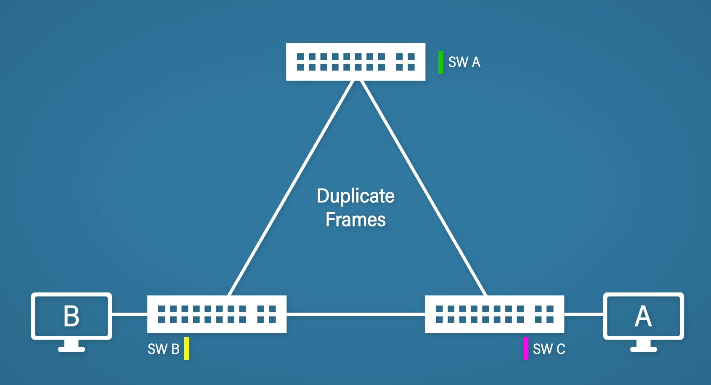
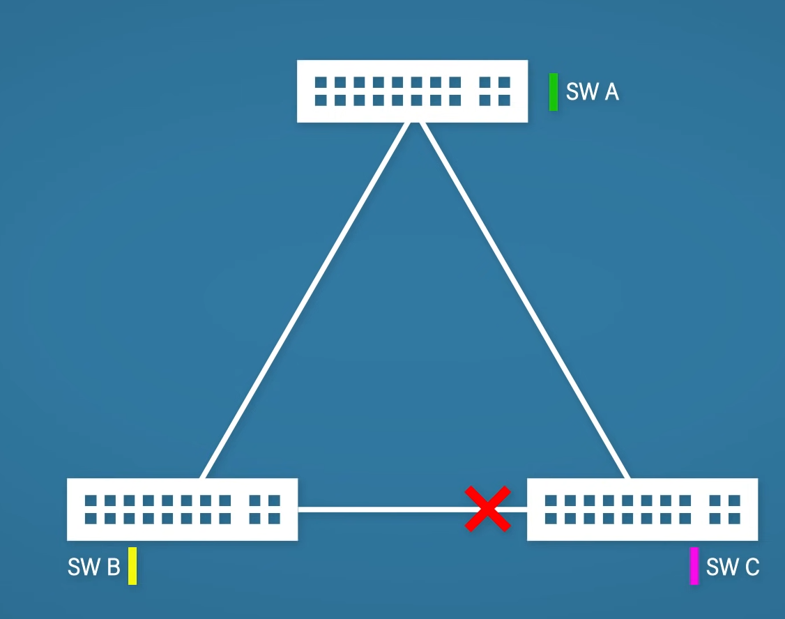
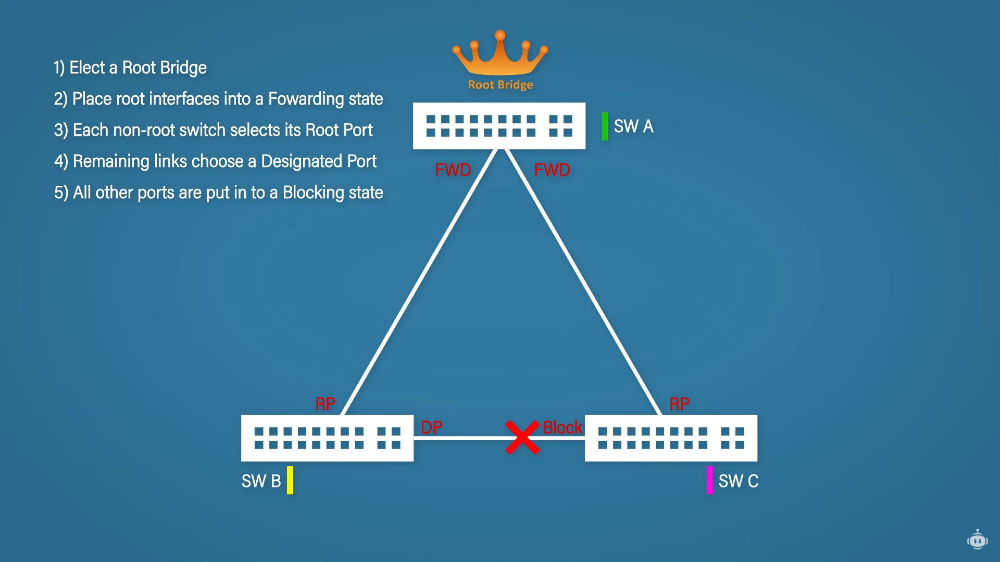
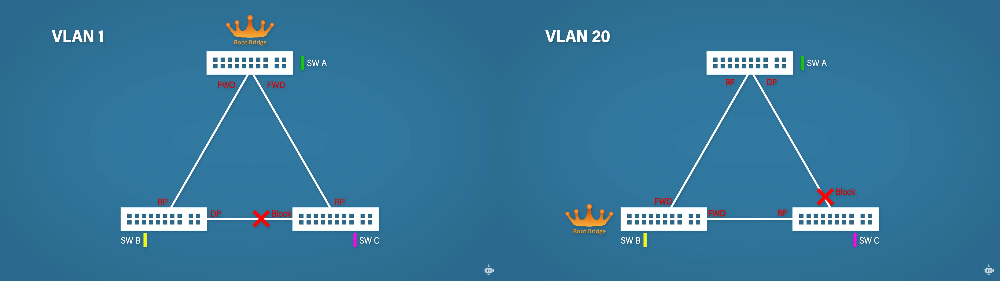
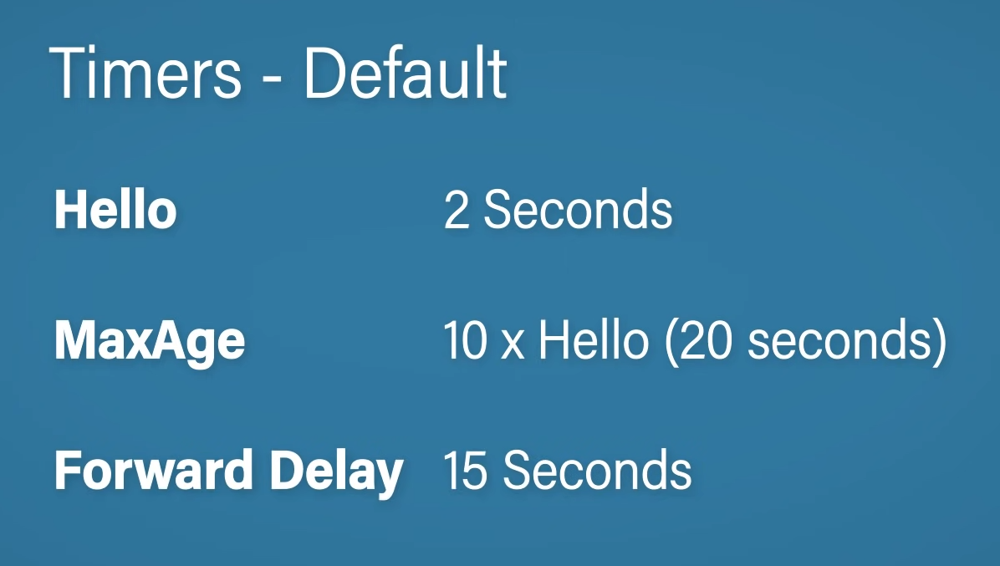
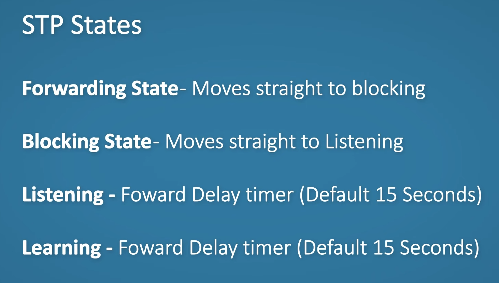
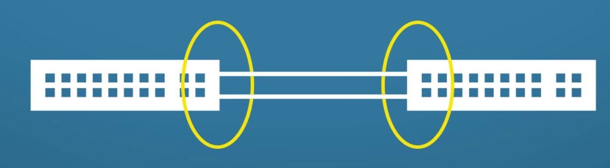

# Network Redundancy

A single point of failure (SPOF) can take the entire network down. The goal is to find these and eliminate them.

In the above infrastructure there are multiple single points of failures:
* Network Interface Card
* Link
* Switch
* Routers (and their link)

The solution is redundancy and ensuring proper failover procedure.

The above example uses a VPN as a backup (since it is routed over the internet, it is slower than the dedicated WAN).

## FHRP

Having only one router poses a single point of failure. By adding a backup router, we can ensure redundancy, however this in itself does not guarantee failover, since each host can only have one default gateway set.

First hop redundancy protocol solves this problem by introducing a virtual IP and MAC address shared by both routers (with only one using it actively). In case a router goes down, the other router can still respond.

FHRP is a family of protocols that include:
* HSRP - Hot Standby Routing Protocol
* VRRP - Virtual Router Redundancy Protocol
* GLBP - Gateway Load Balancing Protocol

### HSRP

Routers send HELLO messages every 3 seconds. Active and the standby routers are selected. The active router takes ownership of the virtual IP. The active router is selected based on the highest HSRP priority, in case of a tie, the highest IP address. The virtual IP is set up by the administrator.

The hold time is 10 seconds by report, if no HELLO message is received during this time, the standby router takes over. If the active router becomes available again, it becomes the backup router (unless otherwise configured using standby preempt).

### VRRP

Routers choose a master and a backup. One of the routers will be the virtual IP owner (if this router is available, it will be the master, otherwise the router with the highest priority or IP as in the case of HSRP).

Advertisements are sent every second, the master down (hold time) is 3 seconds, after which the backup router takes the role of the master. Unlike HSRP, the master router will take bake its role if it becomes available again.

### GLBP

Active and standby routers are selected. Routers share the same virtual IP while but each has their own virtual MAC address. This gives load balancing ability to the router group as both of the routers can respond to the requests.

HELLO messages are sent every 3 seconds and the hold timer is 10 seconds. If a router becomes unavailable, the other takes ownership of its virtual MAC address until it becomes available again.

## STP

Spanning tree protocol is used to prevent loops in a network with redundant switches.

### Problem

Without STP a broadcast storm would happen:

The MAC address table will also be unstable in case of a broadcast storm (eventually all switches will have the same MAC address mapped to all of their connected ports):

Since the switch does not know about the target host MAC address duplicate frames will be sent (since the message is flooded to both switch A, [which then forwards it to C] and C).

To address these issues, the switches will need to block a port to eliminate the loop:

### Operation

1. The switches elect a root bridge.
   1. The switch with the lowest BID (bridge ID) will get elected. The bid consist of the STP priority and the switch's MAC address.
   2. By default, all switches list themselves as the root first in their BPDU (bridge protocol data unit).
   3. Switches exchange BPDUs.
   4. The switch with the lowest BID is elected as the root bridge.
2. Root interfaces are set into a forwarding state.
3. Non-root switches select their root ports (ports which communicate with the root bridge). These are selected based on the port cost (based on the cost to reach the root bridge, which is weighed by bandwidth).
4. Remaining links choose a designated port. Which side of the link becomes the designated port is decided based on the lowest root cost, lowest BID, lowest neighbor port priority and lowest neighbor port number, in this order.
5. All other ports are put into a blocking state.

PVST (per VLAN spanning tree) allows different setup per VLAN:

#### Port Roles

* Root port - the best port to reach the root bridge.
* Designated port - best route to the root bridge on a link.
* Non-designated port - port in a blocking state.

### Port States

* Disabled - not in use.
* Blocking - actively blocks traffic.
* Listening (transitional state) - does not forward traffic and or learn MAC addresses.
* Learning (transitional state) - does not forward traffic but learns MAC addresses.
* Forwarding - sending and receiving traffic.

#### Convergence

Convergence in STP is slow, it takes about 50 seconds to re-converge (20 from MaxAge, 15 from listening and 15 from learning). Rapid spanning tree protocol (RSTP) addresses these issues.

#### PortFast And BPDU Guard

PortFast disables STP so that the host can immediately be connected to the network. The issue with this is that it could potentially lead to a loop if a switch is connected to that port. BPDU guard addresses this by blocking the port and putting it into errdisable state if a switch is connected.

## EtherChannel

Switches can be connected by multiple links. The issue with this is that it is detected as a loop in STP, meaning that one of the ports will be blocked. To take advantage of both links, the ports need to be grouped together on both switches forming an EtherChannel.

EtherChannels load balance between the cable, combining the bandwidth of both links. Convergence is automatic in case of link failure. EtherChannel acts as one interface.

EtherChannel can be configured statically or dynamically using PAgP (Port Aggregation Protocol) or LACP (Link Aggregation Control Protocol). The links must have the same duplex, speed and both of them need to be access/trunk, same VLAN configuration and STP interface settings.

### Modes

Different modes are set per port when EtherChannel is enabled using different methods.

* Static - On/On
* PAgP - Desirable/Desirable or Desirable/Auto
* LACP - Active/Active or Active/Passive
* 