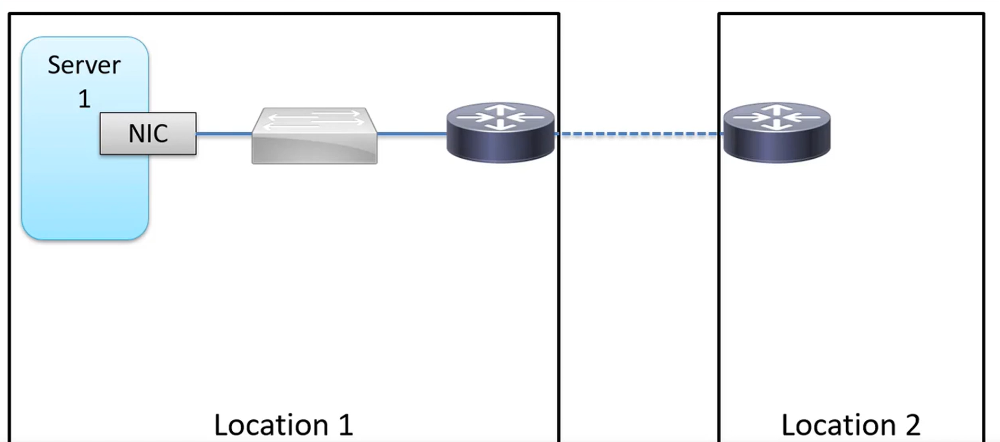
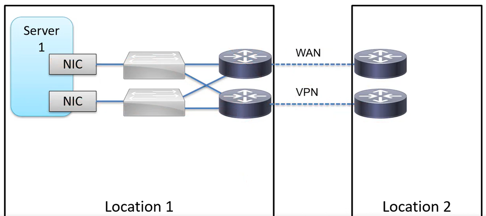

# Network Redundancy

A single point of failure (SPOF) can take the entire network down. The goal is to find these and eliminate them.

In the above infrastructure there are multiple single points of failures:
* Network Interface Card
* Link
* Switch
* Routers (and their link)

The solution is redundancy and ensuring proper failover procedure.

The above example uses a VPN as a backup (since it is routed over the internet, it is slower than the dedicated WAN).

## FHRP

Having only one router poses a single point of failure. By adding a backup router, we can ensure redundancy, however this in itself does not guarantee failover, since each host can only have one default gateway set.

First hop redundancy protocol solves this problem by introducing a virtual IP and MAC address shared by both routers (with only one using it actively). In case a router goes down, the other router can still respond.

FHRP is a family of protocols that include:
* HSRP - Hot Standby Routing Protocol
* VRRP - Virtual Router Redundancy Protocol
* GLBP - Gateway Load Balancing Protocol

### HSRP

Routers send HELLO messages every 3 seconds. Active and the standby routers are selected. The active router takes ownership of the virtual IP. The active router is selected based on the highest HSRP priority, in case of a tie, the highest IP address. The virtual IP is set up by the administrator.

The hold time is 10 seconds by report, if no HELLO message is received during this time, the standby router takes over. If the active router becomes available again, it becomes the backup router (unless otherwise configured using standby preempt).

### VRRP

Routers choose a master and a backup. One of the routers will be the virtual IP owner (if this router is available, it will be the master, otherwise the router with the highest priority or IP as in the case of HSRP).

Advertisements are sent every second, the master down (hold time) is 3 seconds, after which the backup router takes the role of the master. Unlike HSRP, the master router will take bake its role if it becomes available again.

### GLBP

Active and standby routers are selected. Routers share the same virtual IP while but each has their own virtual MAC address. This gives load balancing ability to the router group as both of the routers can respond to the requests.

HELLO messages are sent every 3 seconds and the hold timer is 10 seconds. If a router becomes unavailable, the other takes ownership of its virtual MAC address until it becomes available again.