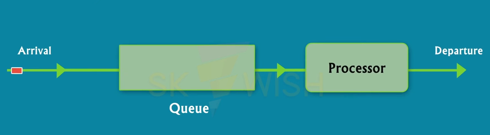
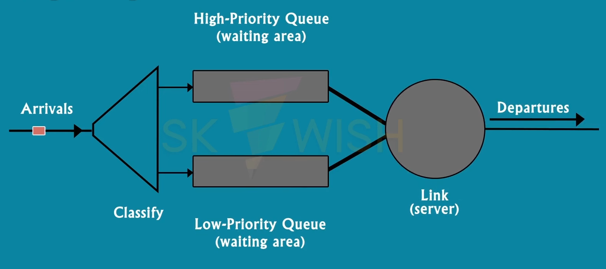
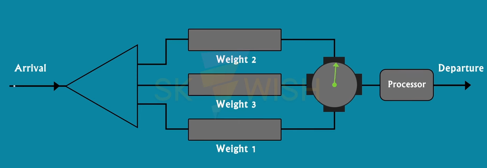
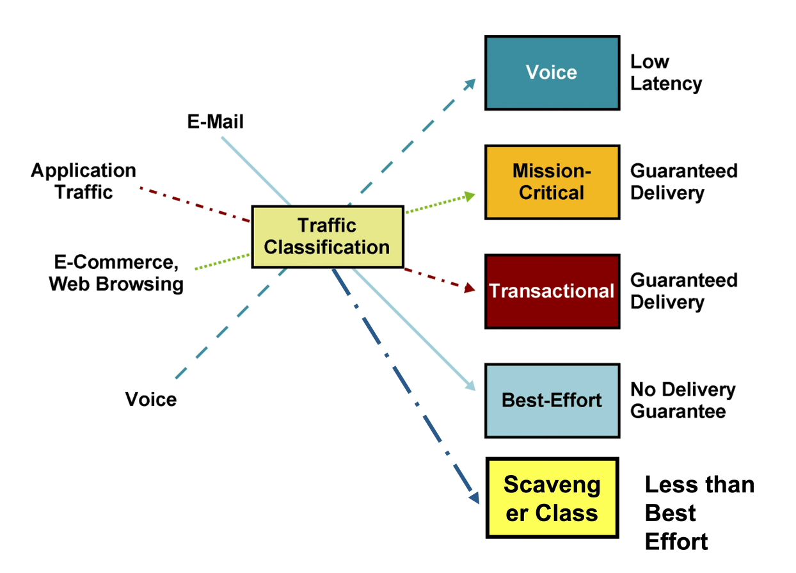

# Quality of Service

_The goal, role and methods of QoS techniques_

Quality of service (QoS) is the capability of the network to provide quality services. The primary goal is to provide priority to a specific type of data (such as real time transmission).

QoS controls:
* Reliability - guaranteeing the delivery of each packet (especially important for non-real time transmission).
* Delay - real time transmission needs the delay minimized.
* Jitter - the variation in delay.
* Bandwidth

## QoS Techniques

QoS can be improved by different techniques:

* Scheduling
* Traffic shaping
* Admission control
* Resource reservation

### Queues

Scheduling is used to treat data from different flows fairly.

Techniques include:

* **FIFO Queuing** - the packets leave the queue in the order they arrived.

* **Priority Queuing** - it consists of two quest (higher and lower priority), the packets are assigned a priority class. Time-sensitive packets get assigned to the higher priority queue and get processed first. It provides better QoS than FIFO, however it has a weakness called starvation, when there are too many higher priority packets and the packets in the lower priority queue cannot be processed because of them.

* **Weighted Fair Queuing** - the queues are processed in a round-robin fashion and the queues are weighted based on priority. The number of packets processed is equal to the weight assigned to the queue.

## Real Life QoS Workflow

QoS service is achieved in 3 steps:
1. Customer requirements - this step includes identifying business critical applications, types of traffic in the network and SLAs (Service Level Agreements).
2. Dividing the traffic into classes - classifying types of traffic based on their priority.

3. Defining QoS policy - actually implementing QoS based on priority. QoS must be configured on every network component.

### QoS Tools

* Classification and marking - categorizing traffic based on priority.
* Queuing - using appropriate queues based on the requirements.
* Shaping and policing - rate-limiting traffic if necessary.