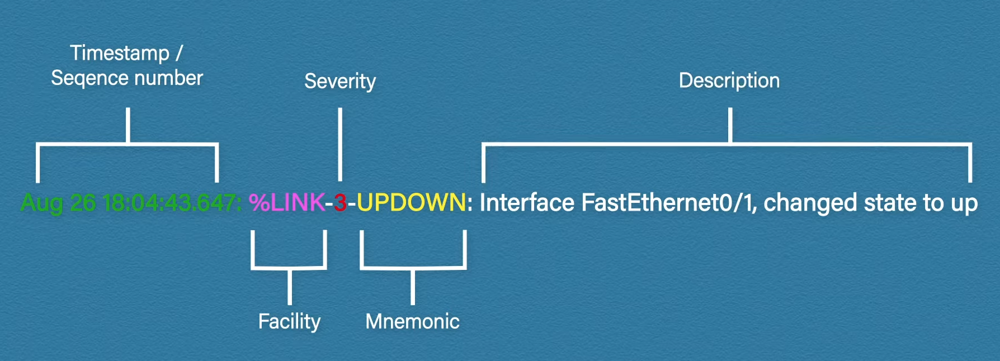
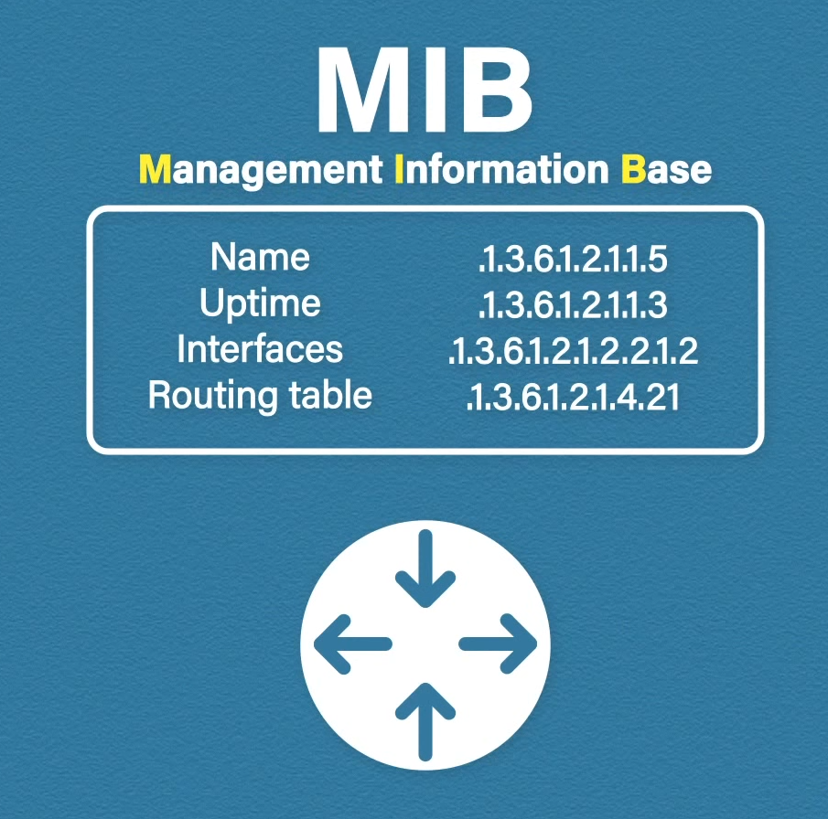
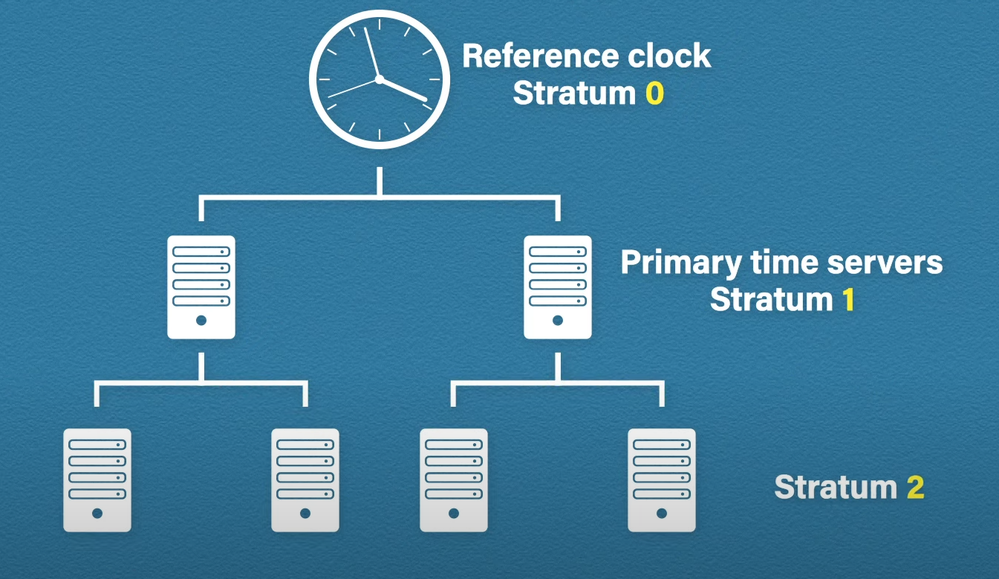

# Network Monitoring Tools

## Syslog

A syslog server allows all the network devices to send their logs there. Syslog uses UDP 514. A benefit of central log storage is data retention (Cisco devices store logs in RAM which means the log information is gone on reboot).

## Log Message

Breakdown of Cisco-style message format:

The facility represents the process that generates the message.

### Severity

Syslog has 8 severity levels:

| Code | Severity      | Description                       |
|------|---------------|-----------------------------------|
| 0    | Emergency     | System is unusable                |
| 1    | Alert         | Action must be taken immediately  |
| 2    | Critical      | Critical conditions               |
| 3    | Error         | Error conditions                  |
| 4    | Warning       | Warning conditions                |
| 5    | Notice        | Normal but significant conditions |
| 6    | Informational | Informational messages            |
| 7    | Debug         | Debug-level messages              |

Sending logs can be filtered based on severity.

### Setup

Syslog needs to be set up on the host and the network device using the `logging` command.

## SNMP

Simple network management protocol helps to monitor the health of the network. SNMP works at UDP port 161.

An SNMP enabled device is called an agent.

The devices have several objects, each assigned an OID (object identifier) and they are stored in a file called MIB (Management Information Base).

An NMS (Network Management System) needs to be connected to the agent.

The NMS can send 3 types of requests:
* Get, GetNext and GetBulk - to retrieve information from the agent. 
* Set - to change some setting of the agent.
* Trap/inform - the agent can inform the NMS about events (e.g. an interface goes down). Tran and inform are similar, but trap does not wait for acknowledgment, while inform waits for that and resends the message in case it does not get it.

## NTP

Network time protocol's job is time synchronization on network devices. It is crucial to have synchronized time on the network, otherwise errors may occur. Inconsistent clocks also make log correlations harder (logs collected from different devices cannot be matched up in time). NTP servers are responsible for synchronization. It uses UDP port 123.

### Operation

Clocks are measured by their stratum values, where 0 is the most accurate and 15 is the least. Anything above 15 is considered unsynchronized.

Reference clocks - highly accurate clocks (atomic clocks, GPS and radio clocks) connected to primary time-servers. At each step away from the reference clocks, the stratum value is incremented by one.

Internet NTP servers, such as pool.ntp.org, are typically between stratum 1-3. The network devices can be synced to these servers.
