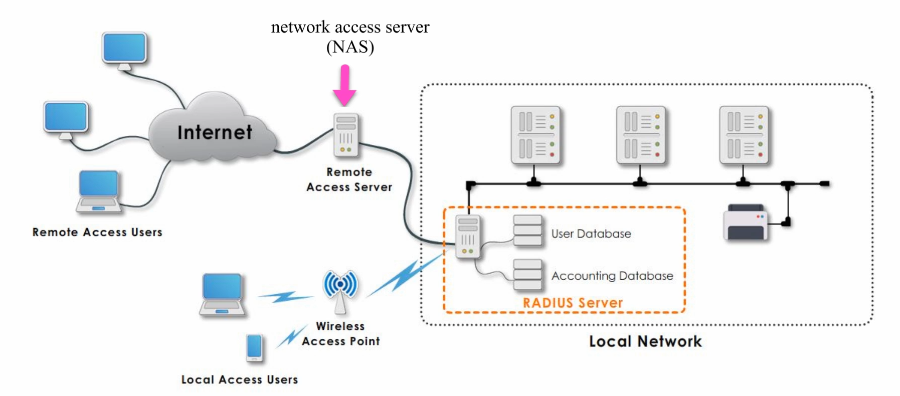

# Defense of Networking Devices

_The defense of networking devices, edge devices, purpose and advantages, disadvantages of centralized protection_

## AAA

AAA stands for:
* Authentication - who are you?
* Authorization - what can you do?
* Accounting - what did you do?

## RADIUS

Remote authentication dial-in user service provides centralized access to the network relying on the AAA framework.

It uses a NAS (network access service) or a WAP (wireless access point) to communicate with the RADIUS server to authenticate dial-in users and keeps track of their activities.

### Operation

The remote is called the supplicant, while the NAS/WAP is called the RADIUS client.

Steps:
1. Authentication request - the user sends a request to access the network using their user id and password.
2. The RADIUS client forwards this request to the RADIUS server.
3. The RADIUS server checks whether the user exists in the database with that user id and password.
4. If the user was successfully verified, the RADIUS server sends an authentication acknowledgment to the client.
5. Recording starts about the user in the accounting database.
6. The client grants access to the supplicant.

## TACACS+

Terminal access controller access control system provides centralized access to the networking relying on the AAA framework. TACACS+ is used for administrator access to network devices like routers and switches. It should only be deployed in a fully trusted internal network (no direct access from untrusted networks).

### RADIUS vs TACACS+

| Feature                          | RADIUS                                                                 | TACACS+                                                                                 |
|----------------------------------|------------------------------------------------------------------------|-----------------------------------------------------------------------------------------|
| Transport Protocol               | UDP                                                                    | TCP                                                                                     |
| Port                             | 1645/1646 or 1812/1813                                                 | 49                                                                                      |
| Communication & Encryption       | Less secure - only encrypts password                                   | More secure - encrypts the whole packet including username, password, and attributes    |
| Can Authenticate Network Devices | No                                                                     | Yes                                                                                     |
| Primary Use                      | Network Access                                                         | Device Administration                                                                   |
| Designed For                     | AAA Users/Clients                                                      | AAA Administrator                                                                       |
