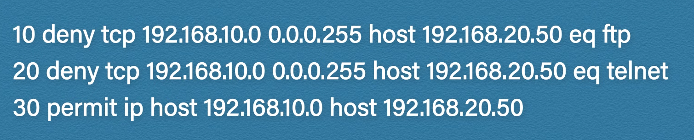
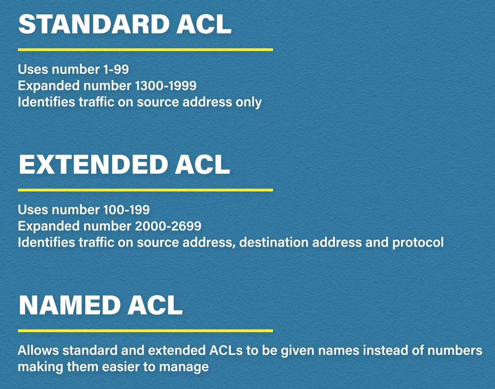
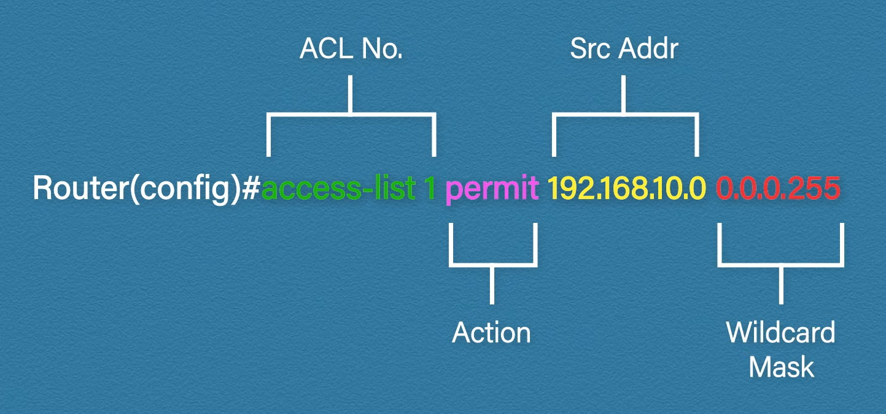
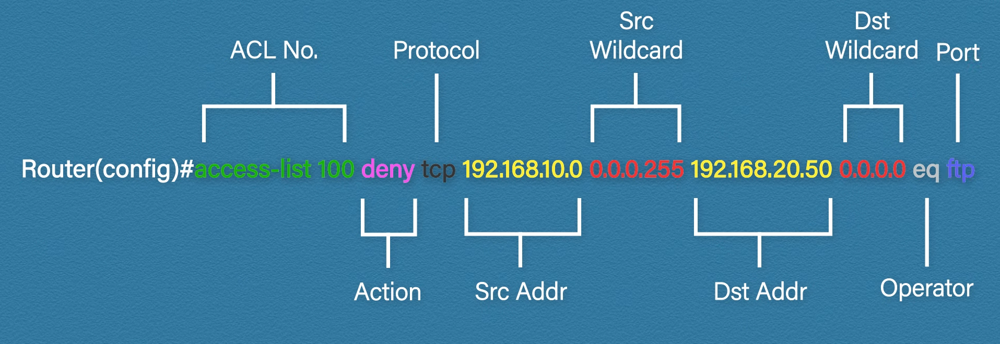

# Traffic Filtering

_The concept, condition and implementation possibilities of traffic filtering with IPv4 and IPv6_

## ACL

Access control lists are rule-based lists to filter traffic. They can identify traffic based on source and destination address and port numbers. They are most commonly used by routers and switches.

Example to an ACL:

The first number determines the order of the rule. The reason why it is incremented by 10 is to leave room for additional rules in between in the future. The ACL is evaluated sequentially, until the first matching rule is found (the rest of the rules will not be checked). On the bottom of the list there is an implicit deny rule.

### Types

#### Standard ACL

The wildcard mask is like an inverted subnet mask. It can only filter traffic based on the source address.

#### Extended ACL

There are various port operators:
* gt = greater than
* It = less than
* neq = not equal
* eq = equal
* range = range specified

#### Named ACL

Basically an extended ACL that bears a name.
