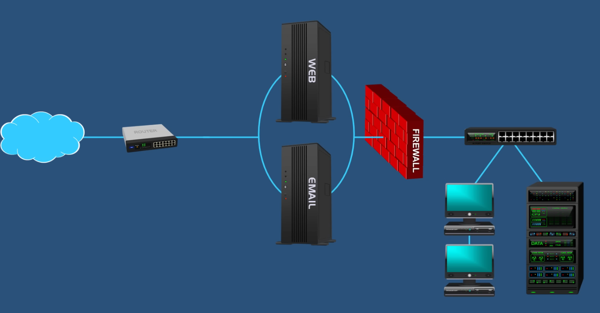
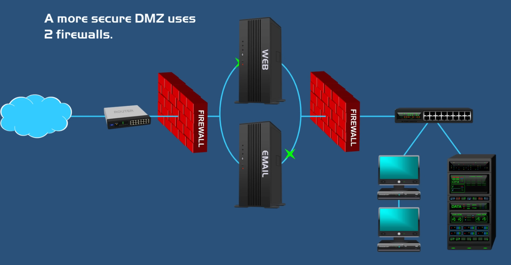

# Firewalls

_Firewall generations, types, architectures, firewall implementations on ISR routers, dedicated firewalls_

Firewalls shield the trusted network from the untrusted network by filtering traffic. Most firewalls by default block everything. Traffic can be allowed by adding rules.

Firewalls can filter traffic based on:
* Source and destination IP address
* Payload content
* Packet protocols
* Application protocols
* Data patterns (indicative of cyberattacks)

Block traffic can be either silently discarded or an error can be sent back to the sender.

## Types

### Packet-Filtering Firewall

The simplest type of firewall that inspects packets and can filter them based on IP, port number and packet type. It is fast and efficient but lacks broader context and does not check the payload.

### Circuit-Level Gateway

Monitors TCP and other network protocol messages as the connection is established, deciding whether the remote system can be trusted. It is easy to set up, but it cannot inspect actual data. 

### Application-level Gateway

Filters packets according to their intended service. While they are secure, they also throttle network performance.

### Stateful Inspection Firewall

It is a good idea to block incoming traffic from all external sources (unless absolutely necessary). The reason why browsing the internet is still possible with this setup is because most firewalls are stateful, and they track connections, so responses from the server will be allowed. Its biggest disadvantage is that it is resource intensive and more expensive.

### Next-Generation Firewall

An NGFW typically includes:
* Application level inspection
* Deep packet inspection
* Intrusion prevention system (IPS) - it looks for malicious traffic and anomalies.
* External threat intelligence - external sources can be used to determine what data to filter (e.g. newly discovered malware).

### Unified Threat Management

UTMs include a set of security features such as:
* URL filtering
* Email scanning
* Data loss prevention

## Firewall Deployment Options

### Network Firewall

It serves a secure gateway between internal network devices and external entities. They are suitable for medium to large organizations, they require a higher level of expertise to set up compared to endpoint firewalls.

### Host-Based Firewall

The previous types are all network firewalls but typically the hosts also have their own firewalls called host-based firewall. This redundant security feature can be really useful in some scenarios, for example in case of an internal network attack.

### Cloud/Hosted Firewalls

Sometimes known as Firewall as a Service, it is a firewall managed by a cloud provider. It is ideal for large enterprises.

## DMZ

A demilitarized zone (also known as a perimeter network) divides the networks into two parts, taking a group of devices inside the firewall and leaving the other outside it.

A more secure approach is to introduce a second firewall that is placed in front of the DMZ.

This makes the setup more secure, since now the attackers would need to penetrate 2 firewalls to get to the internal network.
