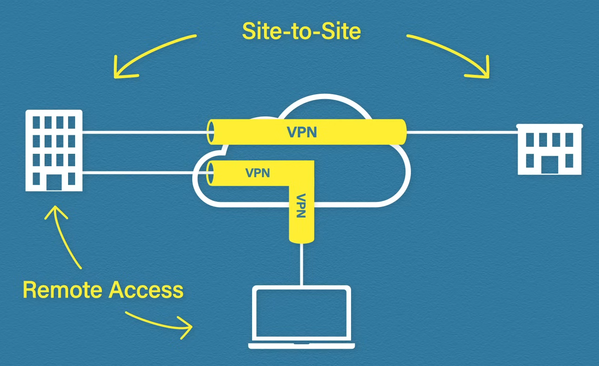
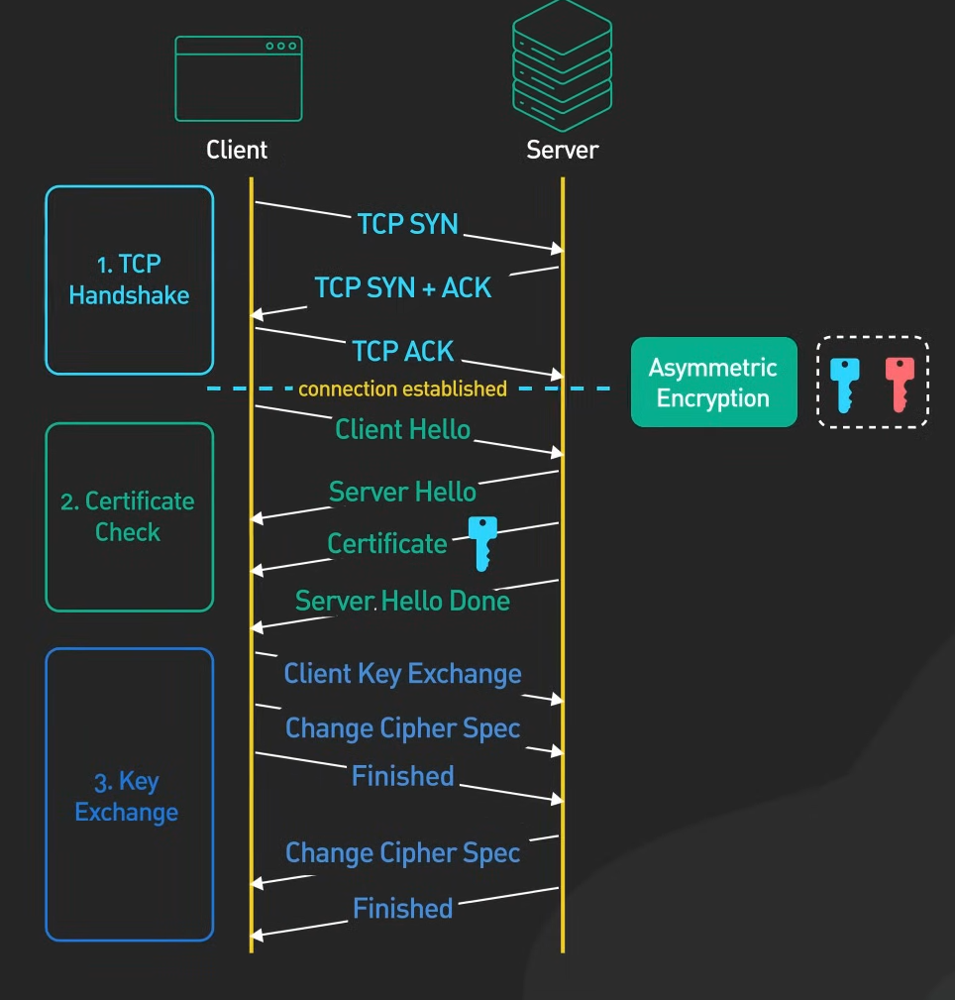

# Protection of Traffic Through Public Networks

## VPN

A virtual private network's job is to ensure the safe delivery of data across public networks.

If a branch office needs access to the head office, it can connect to a VPN to form a safe connection.

### Site-to-site

Site-to-site VPNs are always on, they connect two sites and need they need to be configured on both sites. They are typically configured on a router/firewall. The data is encrypted and a VPN header/trail is added to the packet.

The receiving router can decrypt the data with the help of the encryption key.

### IPsec

The most common type of site-to-site VPN. It is a framework for creating VPNs over a network. It can also be used for remote access VPNs.

#### Operation

Creating a secure tunnel between the sites is done in two phases using IKE (internet key exchange).

1. The two sites negotiate authentication and encryption methods.
2. Creating the IPsec tunnel.

There are two main protocols used:
* Authentication Header (AH) - it offers authentication and integrity (but no encryption).
* Encapsulation Security Payload (ESP) - it offers authentication, integrity and encryption.

There are two types of operation modes:
* Transport mode - it is used when two hosts are connected over public internet.

* Tunnel mode - it is used when two sites (gateways) are connected over the public internet. Tunnel mode hides internal network details by encapsulating the entire original packet (only the address of the VPN gateway is visible).

### Remote access

Remote access VPNs grant access only for one device that can connect from any network. They require an application on the host (e.g. OpenVPN). Remote access VPNs utilize TLS for encryption.

There are two tunneling methods:
* Full tunnel - everything is forwarded through corporate network. Great for enforcing corporate firewall policies.
* Split tunnel - only traffic sent to the corporate network will pass through the VPN. Great for more user privacy and saving bandwidth.

## TLS

HTTP uses plain text for communication, this makes it insecure, since third parties intercepting the data can read it. HTTPS solves this problem by encrypting the data, so only the sender and the receiver can see it. HTTPS is essentially HTTP implemented with TLS (Transport Layer Security) support for encryption. The predecessor of TLS is SSL (Secure Sockets Layer), which has since been deprecated.

### Certificates

The certificate is a file that contains the domain name, the owner organization, the server's public key and the authority that issued the certificate (certificate authority, also known as CA). The CA is a trusted organization that issues certificates. The CA signs the certificate with their private key, so the clients can verify the certificates.

### Establishing Connection

The following steps are carried out to establish HTTPS connection using TLS 1.2:

TLS 1.3 optimizes this procedure by reducing the number of back and forth requests during the handshake and by allowing session resumption, an abbreviated handshake process between parties that already established a connection before.

In summary:
1. TCP handshake
2. TLS handshake - the client sends a HELLO that includes the supported TLS version and cipher suite (encryption algorithms), after which the server chooses the TLS version and the cyber suite responding with a server HELLO and a certificate (including the public key).
3. Key exchange - through an asymmetric algorithm such as RSA (encryption algorithm) or Diffie-Hellman (key exchange algorithm), the parties agree on a shared session key. The TLS procedure concludes.
4. Data transmission continues through symmetric encryption.
