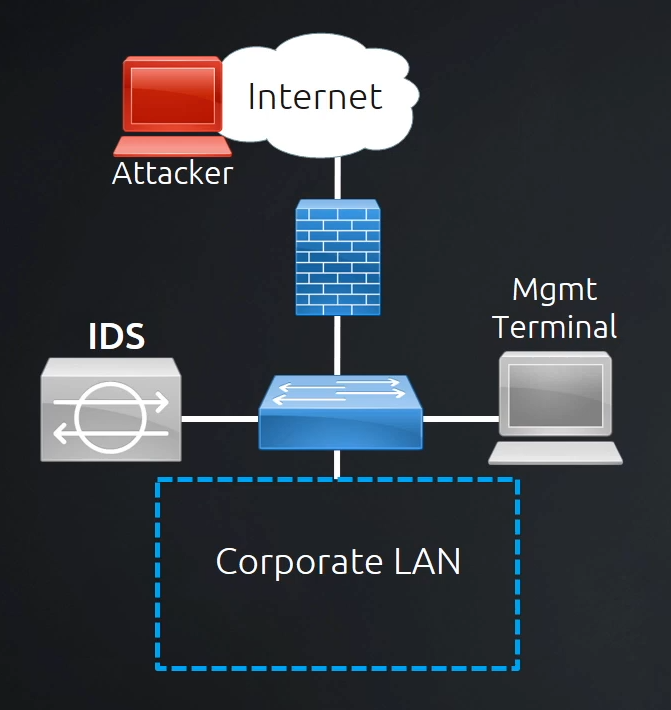

# Instruction Detection and Prevention

## Intrusion Detection System

IDS analyzes traffic that passes through the network and sends an alert if it detects an anomaly (it can analyze the data in the packet and alert if it finds known malware). This is done by first running a network normalization process where they learn what the normal functions of the network are like. It does not need to be in line with the firewall, sometimes it is built-in the firewall, sometimes a separate device is used for IDS that copies network traffic and analyzes it.

### Types

* HIDS - host based intrusion detection system (it works on a computer).
* NIDS - network based intrusion detection system.

## Instruction Prevention System

IPS includes the functionalities of IDS and extend them by.... It is typically placed in line with the firewall. The IPS stands as an extra point of protection besides the firewall. If it detects an anomaly, it sends an alert and also blocks the traffic.

## Alert Types

* True positive - a genuine threat that was detected.
* True negative - non-malicious traffic that is correctly detected.
* False positive - benign traffic identified as malicious.
* False negative - malicious traffic which was not detected as a threat.

Ideally, only the first two should exist.
